<!--@@author theeugenechong-->

# Developer Guide

## Introducing cOOPer

Welcome to cOOPer's Developer Guide!

cOOPer is a **Command Line Interface (CLI) desktop** application developed to simplify administrative processes of **tech startups** such as **communication** and **finance management**.

cOOPer was developed in **Java 11** following an **Object-Oriented Programming (OOP)** paradigm, hence the letters OOP in its name.

This developer guide is for software designers, developers, and software testers of cOOPer. It will be your reference manual if you are looking to:
- **Know more** about cOOPer's internal **software design**
- **Improve** cOOPer's internal **software design**
- **Add** more features to cOOPer
- **Enhance** cOOPer's existing features
- Perform software **testing** on cOOPer

## What's in this Developer Guide
- [How this Developer Guide Works](#how-this-developer-guide-works)
- [Acknowledgements](#acknowledgements)
- [Setting Up and Getting Started](#setting-up-and-getting-started)
  - [Setting up cOOPer on your computer](#setting-up-cooper-on-your-computer)
  - [Before you code](#before-you-code)
- [Design](#design)
  - [Overview](#overview)
  - [Architecture](#architecture)
  - [Ui component](#ui-component)
  - [Parser component](#parser-component)
  - [Verification component](#verification-component)
  - [Command component](#command-component)
  - [Resources component](#resources-component)
  - [Storage component](#storage-component)
  - [Util component](#util-component)
- [Implementation](#Implementation)
    - [Parsing user input](#parsing-user-input)
    - [Verifying user credentials](#verifying-user-credentials)
    - [Requesting a resource](#requesting-a-resource)
    - [Interacting with finance functions](#interacting-with-finance-functions)
    - [Generating a PDF from the financial statement](#generating-a-pdf-from-the-financial-statement)
    - [Declaring an availability](#declaring-an-availability)
    - [Scheduling a meeting](#scheduling-a-meeting)
    - [Interacting with the forum](#interacting-with-the-forum)
    - [Saving and loading data](#saving-and-loading-data)
- [Appendix: Requirements](#appendix-requirements)
  - [Product Scope](#product-scope)
    - [Target user profile](#target-user-profile)
    - [Value proposition](#value-proposition)
  - [User Stories](#user-stories)
  - [Non-functional Requirements](#non-functional-requirements)
  - [Glossary](#glossary)
- [Appendix: Instructions for Manual Testing](#appendix-instructions-for-manual-testing)
  - [Launch and shutdown](#launch-and-shutdown)
  - [Sign-in](#sign-in)
  - [Viewing help](#viewing-help)
  - [Finance actions](#finance-actions)
  - [Generating the PDF](#generating-the-pdf)
  - [Meetings actions](#meetings-actions)
  - [Forum actions](#forum-actions)
  - [Logging out](#logging-out)

<div style="page-break-after: always;"></div>

## How this Developer Guide Works

Throughout this developer guide, you will see text formatted differently from normal text, as well as symbols appearing before another line of text.
The table below explains the formatting and symbols in this developer guide.

**Formatting/Symbol** | **Meaning**              |
------------|------------------------------------|
*italics* |Text in italics represent terminology specific to using / developing cOOPer.
**bold**|Text in bold emphasizes the text's importance and indicates that you should pay more attention to the text.
`code` |Short lines of text highlighted as such indicate a class, method, component or user input.<br> It is also used to represent directories / file paths.
ℹ️  |The info symbol indicates useful information about diagrams / content in this developer guide.
💡     |The light bulb symbol indicates a useful tip which eases the development of cOOPer.

[⬆️ Back to top](#whats-in-this-developer-guide)

<div style="page-break-after: always;"></div>

## Acknowledgements
This section includes the sources of code, documentation and third-party libraries reused / adapted in developing cOOPer.
1. The [dopsun chatbot-cli](https://github.com/dopsun/chatbot-cli) is a third-party library used to ease the parsing of user input.
2. The implementation of [the `Storage` component](https://github.com/theeugenechong/ip/tree/master/src/main/java/duke/storage) was adapted from one of our member's CS2113T Individual Project (iP). A few of the methods for file reading and file creation were reused.
3. The implementation of the PBKDF2 algorithm for storing passwords was adapted from [this website](https://www.quickprogrammingtips.com/java/how-to-securely-store-passwords-in-java.html). The two methods for generating the hash as well as obtaining the salt were reused, but tweaked slightly in our implementation.
4. The method used to convert an input stream to a file in `Util.java` was adapted from [this website](https://www.baeldung.com/convert-input-stream-to-a-file). 
5. The method used to make a _POST Request_ to an online LaTeX compiler for the `generate` feature was adapted from [this website](https://www.baeldung.com/httpurlconnection-post).
6. [JUnit 5](https://junit.org/junit5/) is a third-party library used to perform software testing for cOOPer.

[⬆️ Back to top](#whats-in-this-developer-guide)

<div style="page-break-after: always;"></div>

## Setting Up and Getting Started

> 💡 These are the **software / tools** used in developing cOOPer. You are recommended to use them too:
> - _**IDE**_: IntelliJ IDEA (highly recommended)
> - _**JDK**_: Java 11 
> - **Version control**: Git 
> - **Git GUI**: Sourcetree
> - **Build system**: Gradle

### Setting up cOOPer on your computer
1. Fork [this repo](https://github.com/AY2122S1-CS2113T-W13-4/tp) and clone the fork into your computer.
2. If you are using IntelliJ IDEA, ensure that IntelliJ is configured to use **JDK 11**. You can refer to IntelliJ's own documentation [here](https://www.jetbrains.com/help/idea/sdk.html#set-up-jdk) to correctly configure the JDK.
3. Import the project as a Gradle project. You can follow [this guide](https://se-education.org/guides/tutorials/intellijImportGradleProject.html) to find out how to import the project into IntelliJ.
4. Verify the setup by running `cooper.Cooper`
   1. Navigate to `src/main/java/cooper/Cooper.java`
   2. Right click on `Cooper.java` and select 'Run Cooper.main()'.
   3. You should see the following output if the setup was done correctly:

```
            /$$$$$$   /$$$$$$  /$$$$$$$
           /$$__  $$ /$$__  $$| $$__  $$
  /$$$$$$$| $$  \ $$| $$  \ $$| $$  \ $$ /$$$$$$   /$$$$$$
 /$$_____/| $$  | $$| $$  | $$| $$$$$$$//$$__  $$ /$$__  $$
| $$      | $$  | $$| $$  | $$| $$____/| $$$$$$$$| $$  \__/
| $$      | $$  | $$| $$  | $$| $$     | $$_____/| $$
|  $$$$$$$|  $$$$$$/|  $$$$$$/| $$     |  $$$$$$$| $$
 \_______/ \______/  \______/ |__/      \_______/|__/
=========================================================================
Hello I'm cOOPer! Nice to meet you!
=========================================================================
Log in or register to gain access to my features!
To log in, enter "login [yourUsername] /pw [password] /as [yourRole]".
To register, enter "register [yourUsername] /pw [password] /as [yourRole]".

To exit, enter "exit".
=========================================================================
>> [Logged out]
```

5. Run JUnit tests (optional):
      1. Navigate to `src/test`.
      2. Right click on `test` and select 'Run 'All tests' '.
      3. All the tests should pass, and you should see the following:

<p align="center">
    <br>
</p> 

### Before you code
1. **Configure coding style**<br>
If you are using IntelliJ IDEA, follow [this guide](https://se-education.org/guides/tutorials/intellijCodeStyle.html) to set up IntelliJ to match our coding style.
2. **Set up Continuous Integration (CI)**<br>
GitHub automatically detects the GitHub Actions config file located in the `.github/workflows` folder. CI for cOOPer is automatically run at each push to the 'master' branch or whenever a pull request is created.
3. **Get to know cOOPer's design**<br>
One last thing to know before you start coding is cOOPer's overall software design. You are recommended to get some sense of cOOPer's overall design in the [Design](#design) section below.

[⬆️ Back to top](#whats-in-this-developer-guide)

<div style="page-break-after: always;"></div>

## Design

> 💡 The architecture diagram and _UML_ diagrams in this document were created using **draw.io**. The `.png` templates used to create the diagrams can be found in the [`developerGuideDiagrams`](https://github.com/AY2122S1-CS2113T-W13-4/tp/tree/master/docs/developerGuideDiagrams) folder. 
> To create and edit diagrams, access the draw.io [website](https://app.diagrams.net/), select 'Open Existing Diagram' and open the desired `.png` file. Any changes to the diagram will be saved automatically.

### Overview

cOOPer consists of two main layers: the _**verification** layer_ and the _**features** layer_ as shown in the diagram below.
cOOPer recognizes different sets of inputs at each layer.

<p align="center">
    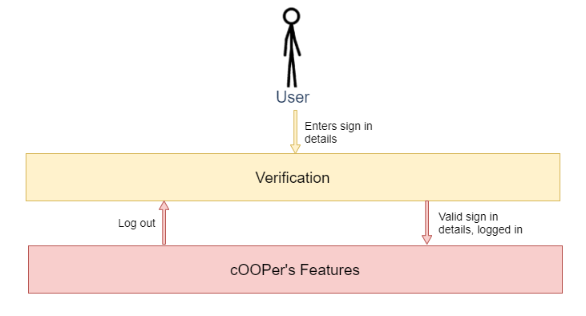<br>
</p> 

Upon launching the app, the user starts at the _**verification** layer_ where they can only [log in](UserGuide.md#logging-in-login) or [register](UserGuide.md#registration). 
Entering valid credentials will then grant the user access to the _**features** layer_ where they can input commands to use cOOPer's features. 
At this layer, entering the `logout` command will bring the user back to the _verification layer_.

<div style="page-break-after: always;"></div>

### Architecture

<p align="center">
    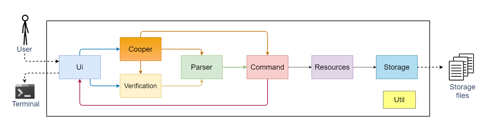<br>
</p> 

The **Architecture Diagram** above shows the high-level design of cOOPer and how cOOPer's components are connected.

`Cooper` contains the main method of the program. `Cooper`'s responsibilities are as such:
- Upon **launching the app**, `Cooper` initializes the components and loads stored user data into the components. 
- While the **app is running**, `Cooper` reads user input which is then processed by the components to produce a result.
- Upon **shutting down the app**, `Cooper` shuts down the components and performs cleaning up where necessary. 

Apart from `Cooper`, the rest of the app consists of these seven components:
- [`Ui`](#ui-component): Handles the reading of user input and printing of messages to the terminal.
- [`Parser`](#parser-component): Interprets and validates user input.
- [`Verification`](#verification-component): Verifies that the user is signing in to cOOPer with valid credentials.
- [`Command`](#command-component): Executes commands which are parsed from user input.
- [`Resources`](#resources-component): Manages data for cOOPer's finance, meetings and forum features while the app is running.
- [`Storage`](#storage-component): Loads data from, and saves data to storage files in the computer hard disk.
- [`Util`](#util-component): Provides utility which help with some of cOOPer's features.

#### Interaction of the architecture components to process user input
- The sequence diagram below provides a general overview of how cOOPer's components interact with each other when a user enters their **sign in details** at the _**verification layer**_.

> ℹ️`userInput` represents the credentials input by the user for verification. For example, `register John /pw 12345 /as admin`.

<p align="center">
    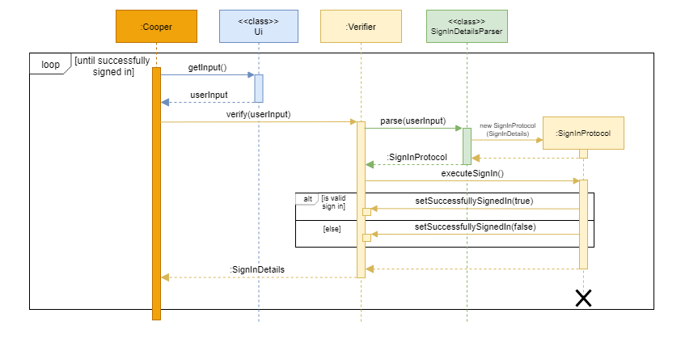<br>
</p> 

- The next sequence diagram below provides a general overview of how cOOPer's components interact with each other when a user enters a **command** at the _**features layer**_.

> ℹ️ `userInput` represents a command input by the user. For example, `meetings`.<br>
> ℹ️`XYZCommand` is an object representing a command recognised by cOOPer. For example, `MeetingsCommand`.

<p align="center">
    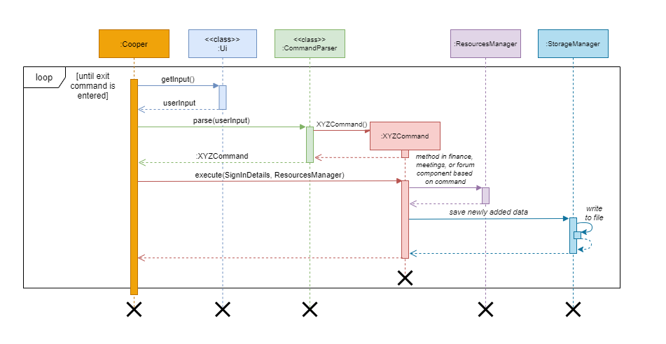<br>
</p> 

[⬆️ Back to top](#whats-in-this-developer-guide)

<div style="page-break-after: always;"></div>

### Ui Component

**API**: [`cooper.ui`](https://github.com/AY2122S1-CS2113T-W13-4/tp/tree/master/src/main/java/cooper/ui)

<p align="center">
    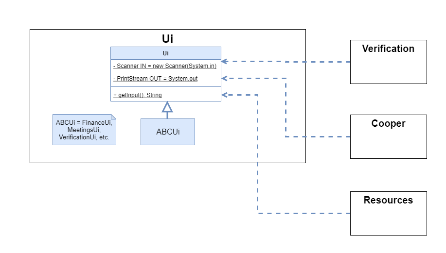<br>
</p> 

- The `Ui` component consists of a parent `Ui` class and its subclasses as shown by the class diagram above.
- The parent `Ui` class contains general constants and methods used across cOOPer's components which read user input and print recurring messages.
- On the other hand, the subclasses for the different components in cOOPer (`ABCUi`) contain constants and methods specific to the function of that component. 
For example, `FinanceUi` contains a method `printBalanceSheet()` which prints a balance sheet formatted with headers containing the entries input by the user.
- The classes in the `Ui` component have *static* methods so `Cooper` does not need to contain a reference to `Ui`.

The `Ui` component:
- Reads in user input from the terminal.
- Prints status messages, error messages and messages prompting the user for input.
- Displays a label besides cOOPer's prompt to indicate which stage of cOOPer the user is in. For example, the `[Logged out]` label indicates that the user is currently logged out of cOOPer.
- Is used by `Verification` and `Cooper` mainly for reading user input, while it is used by `Resources` mainly for printing output messages.

[⬆️ Back to top](#whats-in-this-developer-guide)

### Parser Component

**API**: [`cooper.parser`](https://github.com/AY2122S1-CS2113T-W13-4/tp/tree/master/src/main/java/cooper/parser)

<p align="center">
    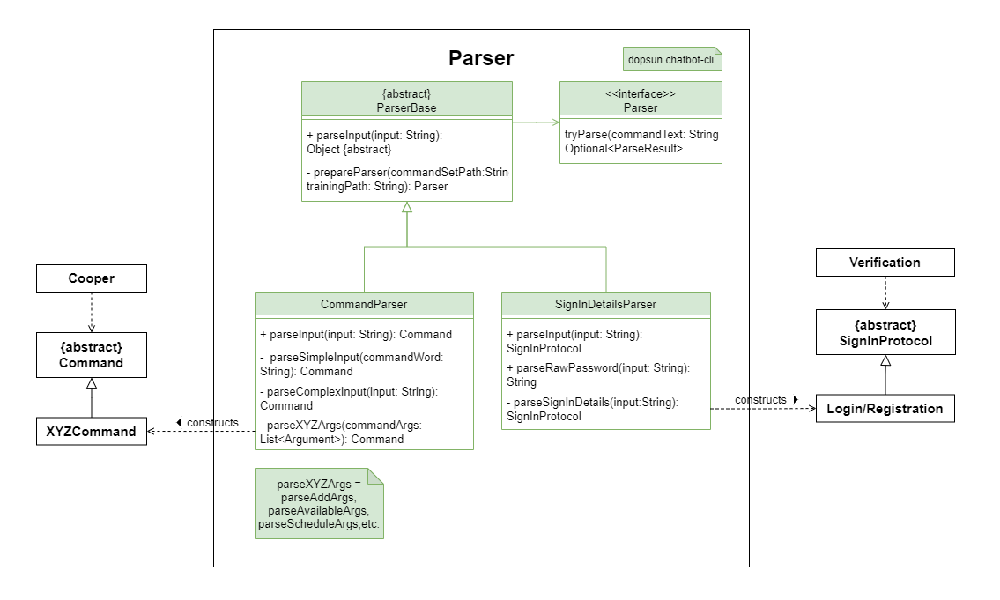<br>
</p>

- The `Parser` component consists of an abstract `ParserBase` class with its subclasses, `CommandParser` and `SignInDetailsParser`. 
- To emphasize the different [layers](#overview) of cOOPer, different types of objects are constructed from user input at different layers. 
User input at the _verification layer_ will be parsed to construct a `SignInProtocol` object while user input at the _features layer_ will be parsed to construct a `Command` object. 
- The `SignInProtocol` object executes the signing in of the user with details provided while the `Command` object executes the command input by the user.
- `ParserBase` contains a reference to the `Parser` *interface* from the [dopsun chatbot-cli](https://github.com/dopsun/chatbot-cli) library used by cOOPer. 
More information about cOOPer's implementation of the library can be found [here](#parsing-user-input).

The `Parser`component:
- Constructs and returns a new `SignInProtocol` / `Command` object with the correct parsed attributes.
- Determines if user input corresponds to any of the commands recognised by cOOPer.
- Validates user input by checking for erroneous command arguments. For example, empty command arguments or entering alphabets where an integer is expected are regarded as erroneous arguments.
- Does not perform any printing of error messages, but instead throws `InvalidCommandFormatException`, `UnrecognisedCommandException` etc. to signal erroneous input.

[⬆️ Back to top](#whats-in-this-developer-guide)

### Verification Component

**API**: [`cooper.verification`](https://github.com/AY2122S1-CS2113T-W13-4/tp/tree/master/src/main/java/cooper/verification)

<p align="center">
    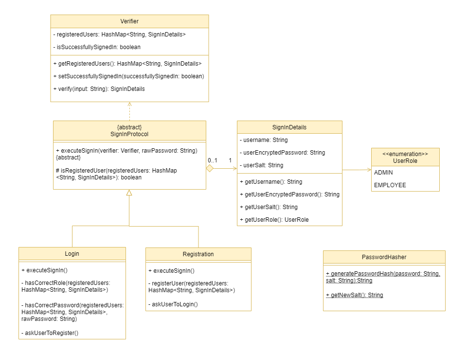<br>
</p>

- The `Verification` component consists of a `Verifier` class which contains the list of registered users and methods to verify user credentials.
- The `SignInProtocol` class is an abstract class representing one of the two sign in protocols, `Login` or `Registration`. 
- The `SignInProtocol` class contains a reference to a `SignInDetails` object which as a whole, represents a **sign in attempt** by the user using one of the two protocols, with the corresponding `SignInDetails`.
For example, a `Login` object containing `SignInDetailsX` represents the user's login attempt with the details `SignInDetailsX`.
- `Login` and `Registration` override `SignInProtocol`'s abstract method, `executeSignIn()` as there are different conditions to check depending on whether the user is trying to log in or register. More on the verification process can be found [here](#verifying-user-credentials).

The `Verification` component:
- Verifies that the user is signing in to cOOPer with valid credentials.
- Grants the user access to the _features layer_ if the user's credentials are valid. A user with valid credentials means the user is logging in to cOOPer with the same username, password and role they registered with.

[⬆️ Back to top](#whats-in-this-developer-guide)

<!--@@author Rrraaaeee-->

### Command Component

**API**: [`Command.java`](https://github.com/AY2122S1-CS2113T-W13-4/tp/blob/master/src/main/java/cooper/command/Command.java)

<p align="center">
    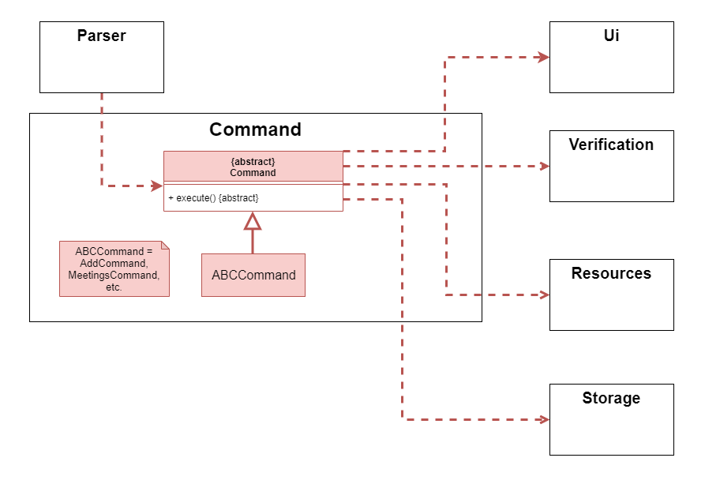<br>
</p>

- The `Command` component consists of an abstract `Command` class and its subclasses as shown in the diagram above.
- Each subclass (`ABCCommand`) overrides `Command`'s abstract method, `execute()` and has its own unique implementation of the method based on how the command is to be executed.
- This makes the addition of a new command to cOOPer relatively easy. For example, you can define a `HelloCommand` which prints out `Hello world!` by inheriting from `Command` and implementing the `execute()` method as such:

```java
public class HelloCommand extends Command {
	// constructors and attributes for execution of the command are omitted
	public void execute() {
		System.out.println("Hello world!");
	}
}
```

- Some subclasses contain extra attributes which are parsed from the arguments in the user input. 
- These attributes aid in the execution of the command.
For example, the [`ScheduleCommand`](https://github.com/AY2122S1-CS2113T-W13-4/tp/blob/master/src/main/java/cooper/command/ScheduleCommand.java) contains a `String` representing the meeting name as well as an `ArrayList` representing the users associated with that meeting.
- The `execute()` method takes in a `SignInDetails` object as a parameter. This object represents the sign in details of a user who has successfully signed in to cOOPer. For some of cOOPer's finance / meetings features which are only accessible by an _admin_, the `UserRole` attribute of this `SignInDetails` object is checked to grant correct access to the feature.

The `Command` component:
- Executes a command entered by the user
- May make changes to the objects in the [`Resources`](#resources-component) component depending on the command.
- Performs the storage of data via the [`Storage`](#storage-component) component if there is any change to the data after the command is executed successfully.
- Prints status messages or error messages to the output via the [`Ui`](#ui-component) component to inform the user of the status of command execution.

[⬆️ Back to top](#whats-in-this-developer-guide)

### Resources Component

**API**: [`cooper.resources`](https://github.com/AY2122S1-CS2113T-W13-4/tp/tree/master/src/main/java/cooper/resources)

<p align="center">
    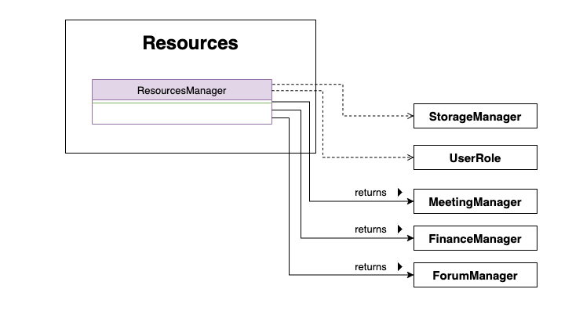<br>
</p>

- The `Resources` component contains `ResourcesManager` which manages access rights to feature managers based on `UserRole`.


  - E.g. the following line will only return a valid reference to `FinanceManager` if `userRole == UserRole.ADMIN`. Otherwise, `null` will be returned indicating the user does not have the access right to that module.

    ```
    FinanceManager financeManager = resourcesManager.getFinanceManager(userRole);
    ```


- It also implements a *give-receive* pattern to pass private members of `ResourcesManager` class to `StorageManager` safely. This is because `StorageManager` has "super privilege" to access internal data structures of feature managers and save to/ load from hard disk. 

The `Resources` component:

- Returns references of feature managers such as `MeetingManager`, `FinanceManager` or `ForumManager` based on `UserRole` of the request body. E.g. Only an *admin* is able to get `FinanceManager` successfully.
- Returns references to `StorageManager` safely upon request.

<!--@@author ChrisLangton-->

#### Finance

**API**: [`cooper.finance`](https://github.com/AY2122S1-CS2113T-W13-4/tp/tree/master/src/main/java/cooper/finance)

<p align="center">
    <br>
</p>

+ The `Finance` component contains the `FinanceManager`, `BalanceSheet`, `CashFlow`, and `Projection` classes, as well as the `FinanceCommand` enumeration.
+ The `FinanceManager` constructs the instances of the `BalanceSheet`, `CashFlow` and `Projection` for use, and contains attributes and methods that aid the related functions.
+ The `FinanceCommamnd` enum helps the `Parser` to understand what `Finance` function is being used, with three states: `CF`, `BS`, and `IDLE`.
+ The `Finance` component also contains the `PdfGenerator` class (not shown in the diagram above) for the `generate` feature. More info on this feature can be found [here](#generating-a-pdf-from-the-financial-statement).

The `Finance` component:
+ Handles adding / listing / generating of balance sheets, cash flow statements, and free cash flow projections.
+ Assists the parser in identifying which function is being used at any given time.

<!--@@author fansxx-->

#### Meetings

**API**: [`cooper.meetings`](https://github.com/AY2122S1-CS2113T-W13-4/tp/tree/master/src/main/java/cooper/meetings)

<p align="center">
    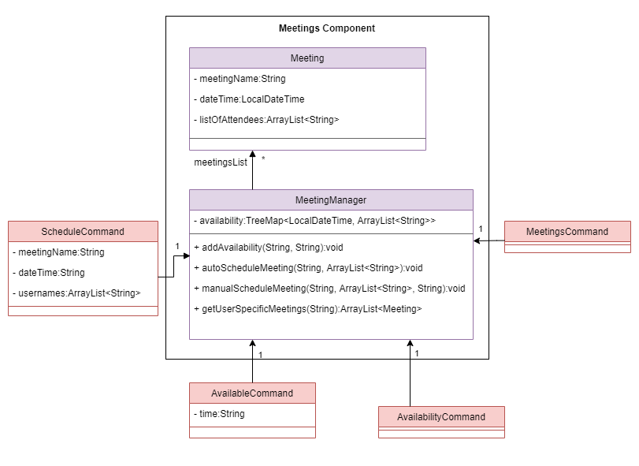<br>
</p>

The `Meetings` component contains the `MeetingManager` and `Meeting` classes.

`MeetingManager` stores **two** attributes:
1. the **timings** along with the **usernames** of the available users, which is a `TreeMap<LocalTime, ArrayList<String>>` object,
2. the **list of meetings** scheduled, which is an `ArrayList<Meeting>` object.

The `MeetingManager` constructs the instances of `Meeting`, and stores it as an `ArrayList<Meeting>` in itself.

The `Meetings` component:

+ Handles the **declaration of availability**
+ Assists in  the **scheduling** of meetings
+ Lists the current availability and meetings

<!--@@author Rrraaaeee-->

#### Forum

**API**: [`cooper.forum`](https://github.com/AY2122S1-CS2113T-W13-4/tp/tree/master/src/main/java/cooper/forum)

<p align="center">
    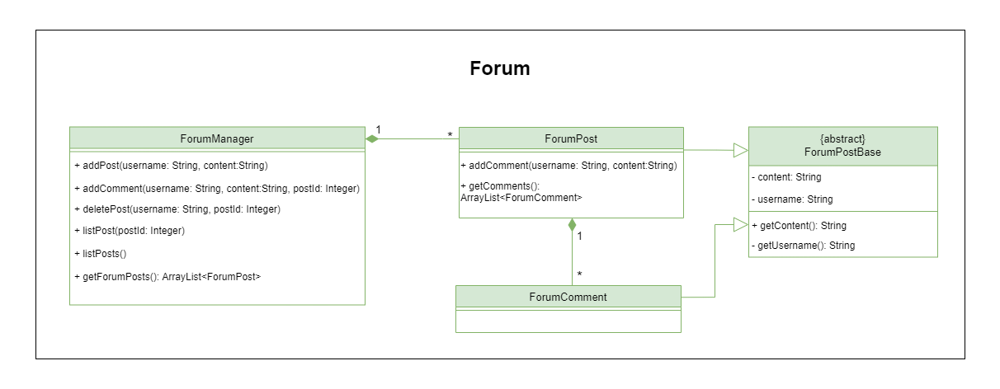<br>
</p>

+ The `Forum` component contains a `ForumManager`, `ForumPost` , `ForumComment` and `ForumPostBase`. Both `ForumPost` and `ForumComment` are inherited from abstract base class `ForumPostBase` as they contain the attributes `content` and `username`. 
+ Forum posts are stored in a hierarchical way where `ForumManager` keeps a list of `ForumPost`s and each `ForumPost` keeps a list of `ForumComment`s.

The `Forum` component:

+ Handles the adding / deleting / listing of posts and comments
+ Deletes a post or comment only if the user requesting the action owns the post or comment, i.e. the `username` of the request body must match the `username` field of the post or comment.

[⬆️ Back to top](#whats-in-this-developer-guide)

<!--@@author theeugenechong-->

### Storage Component

**API**: [`cooper.storage`](https://github.com/AY2122S1-CS2113T-W13-4/tp/tree/master/src/main/java/cooper/storage)

<p align="center">
    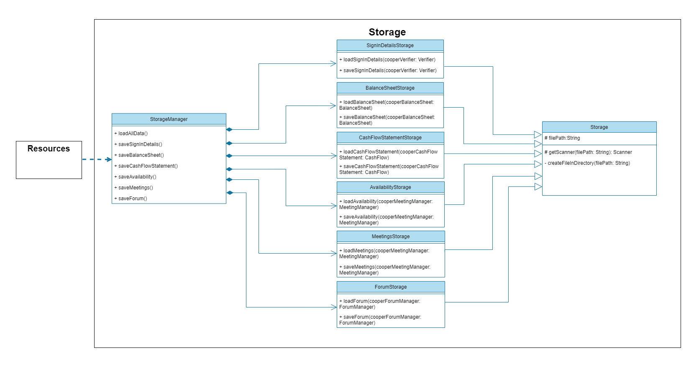<br>
</p>

- The `Storage` component consists of a parent `Storage` class along with its subclasses as shown in the diagram above.
- The `Storage` class contains a `filePath` attribute representing the path of the file where the data is to be stored. It also contains methods common to all its subclasses such as `getScanner()` and `createFileInDirectory()` which aid in the process of writing to and creating the storage file.
- `Cooper` contains a reference to a `StorageManager` object. This `StorageManager` object in turn contains references to each of the subclasses of `Storage` which store cOOPer's data in the [`Verification`](#verification-component) and [`Resources`](#resources-component) components.

> ℹ️We do not put the `StorageManager` class under `Resources` for the following reasons:<br>
> 1. `Storage` class is cOOPer's internal construct for bookkeeping various internal data structures and recovering them at startup. This does not categorise under any features the user can interact with and hence should not be kept under `ResourcesManager`.
> 2. `Storage` has super privileges to access internal data structures of all components in `Resources`. This contradicts the goal of `ResourcesManager` which is to manage access rights to different features depending on user roles, and hence should be kept separate from it.

The `Storage` component:
- Loads stored user data from the storage file specified by `filePath` into the `Verifier`, `FinanceManager`, `MeetingsManager` and `ForumManager` objects upon launching the app.
- Saves data to the storage file specified by `filePath` from the `Verifier`, `FinanceManager`, `MeetingsManager` and `ForumManager` whenever a change is made to the data in these objects.

[⬆️ Back to top](#whats-in-this-developer-guide)

<!--@@author ChrisLangton-->

### Util Component

**API**: [`Util.java`](https://github.com/AY2122S1-CS2113T-W13-4/tp/tree/master/src/main/java/cooper/util/Util.java)

- The `Util` component is a component unrelated to cOOPer and serves mainly as a helper component to make some of cOOPer's features possible.
- There are only two methods in the `Util` class, namely `inputStreamToTmpFile()` and `inputStreamToString()`. 
- `inputStreamToTmpFile()` is used to recreate the dopsun chatbot-cli's training files (originally located in `src/main/resources/parser`). 
In the process of packaging cOOPer into a JAR application, these training files are converted to bytes which are unable to be read in by the chatbot API. Hence, there is a need to recreate these files for the chatbot to work.
- `inputStreamToString()` is used for cOOPer's [`generate`](UserGuide.md#generating-a-pdf-from-the-financial-statement--generate) feature which allows the user to generate a PDF file from data in cOOPer's balance sheet or cash flow statement. 
This method is used to convert the `.tex` template files (located in `src/main/resources/pdf`) into a `String` object which can then be handled easily in the code. More details of the implementation can be found [here](#generating-a-pdf-from-the-financial-statement).

[⬆️ Back to top](#whats-in-this-developer-guide)

<div style="page-break-after: always;"></div>

<!--@@author Rrraaaeee-->

## Implementation

### Parsing user input

cOOPer uses the [dopsun chatbot-cli](https://github.com/dopsun/chatbot-cli) library as its frontend parser that allows you to define any arbitrary *input schema* under `src/main/resources/parser/command-data.properties` 
such as 

```
login = login ${username-hint} /pw ${password-hint} /as ${role-hint}
```

The chatbot's `Parser` library automatically parses the place-holders defined with `$` leaders to strings. For example, `login Yvonne /pw 12345 /as admin` will be parsed 
into the following fields:

```python
{ "username-hint" : Yvonne,
  "password-hint" : 12345,
  "role-hint" : admin }
```

This gives great flexibility and extensibility to the `Parser` component as you do not need to worry about writing new parsing schemes for every command and adding new commands to cOOPer for new features become trivial.

[⬆️ Back to top](#whats-in-this-developer-guide)

<!--@@author theeugenechong-->

### Verifying user credentials
The `Verifier` class facilitates the verification of the credentials of a user registering or logging in to cOOPer.

#### Verification process

Different conditions are checked depending on whether a user is trying to log in or register. For example, if a user is trying to register, cOOPer will check if the username is already registered and asks the user to log in if they are not registered yet.
On the other hand, if an unregistered user is trying to log in, cOOPer will ask the user to register first.

For a registered user trying to log in, cOOPer will first check if the entered password is correct. This is done with the help of the `PasswordHasher` class which hashes the entered password with the user's salt stored by cOOPer. The hash obtained will then be compared to the user's stored hash to determine if the entered password is correct.

If the password is correct, the user's role will then be checked to determine if they are logging in with the role they registered with.

#### Registering a user
The following sequence diagram shows the detailed process of registering a user.
> ℹ️`userInput` is `register John /pw 123 /as admin`.<br>
> ℹ️The `executeSignIn()` method actually takes in a `rawPassword` as its parameters but is omitted in this sequence diagram as the registration process does not require the raw password of the user.

<p align="center">
    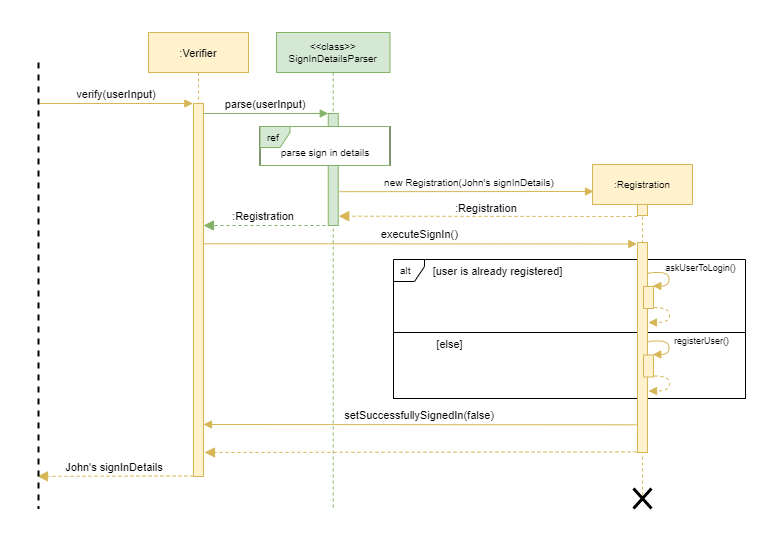<br>
</p>

The `SignInDetailsParser` constructs a `SignInDetails` object parsed from the arguments in `userInput`. This `SignInDetails` object is then used to construct a `Registration` object which executes the registration of the user. This process is shown by the sequence diagram below.

<p align="center">
    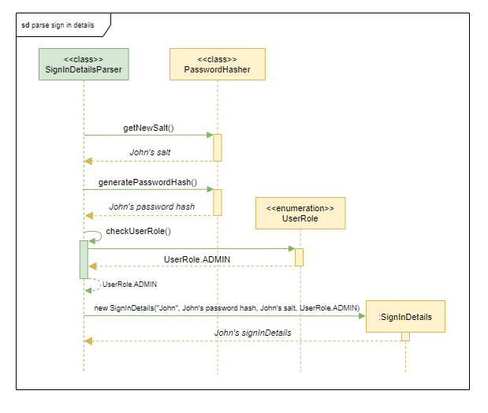<br>
</p>

#### Logging in
Assuming that the above registration has taken place successfully, the following sequence diagram shows the login process of the user.
> ℹ️`userInput` is `login John /pw 123 /as admin`.<br>
> ℹ️The process of parsing `userInput` takes place similar to when a user is registering. The reference frame is omitted in this sequence diagram for simplicity.

<p align="center">
    <br>
</p>

#### Hashing user passwords
The Password Based Key Derivation Function (PBKDF2) hashing algorithm is used for hashing user passwords. This algorithm is used together with a 64-bit salt text for each password before it is hashed to improve security and decrease susceptibility to rainbow-table attacks, where duplicate user passwords are still stored securely.

This algorithm is recommended by the National Institute of Standards and Technology (NIST) for password storage and our implementation also adheres to NIST specifications: <br>
- The hashing algorithm is run for 25000 iterations while NIST only specifies a minimum of 10000 iterations.
- A 64-bit salt text is used while NIST specifies a 32-bit salt text.

[⬆️ Back to top](#whats-in-this-developer-guide)

<!--@@author Rrraaaeee-->

### Requesting a resource

The `Resources` component manages the access rights to other manager components like the `FinanceManager`, `MeetingManager` and `ForumManager`. The following sequence diagram shows the two main operations of `ResourcesManager`:

+ To get a feature manager, such as the `FinanceManager`, the user needs to pass in their `UserRole`. `ResourcesManager` will check if the user has the right access to the feature and returns the requested object if so, and `null` otherwise.
+ The `StorageManager` class has "super privilege" to access internal data structure of `FinanceManager`, `MeetingManager` and `ForumManager`. Private members are passed safely using the *give-receive* pattern, instead of universal `getters`.

<p align="center">
    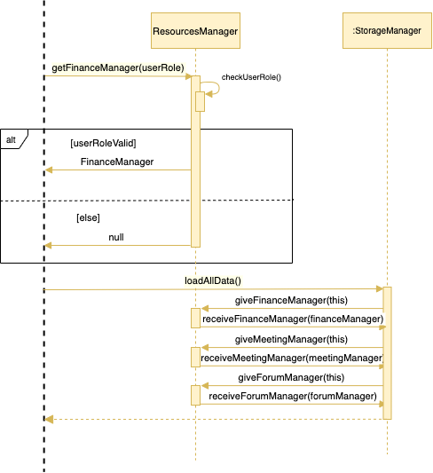<br>
</p>

[⬆️ Back to top](#whats-in-this-developer-guide)

<!--@@author ChrisLangton-->

### Interacting with finance functions
The `Finance` component provides features such as **adding** and **listing** of financial statements, i.e. the balance sheet and cash flow statement as well as **compounded projection** of Free Cash Flow growth.

#### Adding to the financial statement
The sequence diagram below illustrates the process of **adding** to a given financial statement, in this case the balance sheet.

<p align="center">
    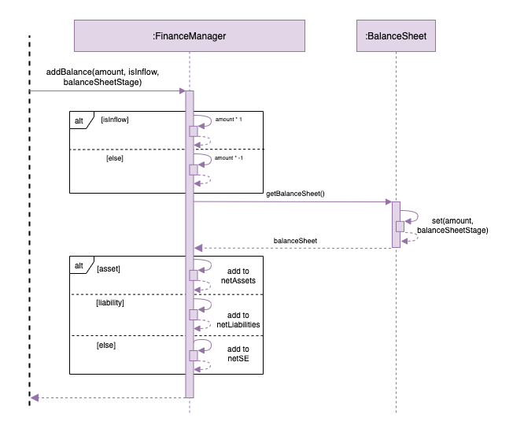<br>
</p>

When the user wants to add an entry to a financial statement, `FinanceManager` will first determine if the amount should reflect as **positive** or **negative** in the financial statement, as well as **which section** of the financial statement the entry belongs to. `FinanceManager` will then add the entry to the respective financial statement and its section's net amount.

#### Viewing the financial statement
When the user wants to view a financial statement with `list`, `FinanceManager` will run a check that the net amounts of each section of the financial statement are calculated correctly before the statement is displayed to the output.

#### Projecting cash flow
When the user wants to project free cash flow, `FinanceManager` will first help to calculate free cash flow by subtracting the CapEx (Capital Expenditure: a field of the cash flow statement) from the total cash from Operating Activities. Subsequently `FinanceManager` will compare this value to the previous year's value, and calculate the percentage increase. This percentage increase will then be used in a recursive [periodic compound interest](https://en.wikipedia.org/wiki/Compound_interest) formula to calculate the following year's free cash flow, at the same percentage increase.

[⬆️ Back to top](#whats-in-this-developer-guide)

<!--@@author theeugenechong-->

### Generating a PDF from the financial statement
The [`PdfGenerator`](https://github.com/AY2122S1-CS2113T-W13-4/tp/blob/master/src/main/java/cooper/finance/pdfgenerator/PdfGenerator.java) abstract class is responsible for the generation of the financial statement as a PDF via the `generate` command. It is inherited by the subclasses, `BalanceSheetGenerator` and `CashFlowStatementGenerator`, with each subclass containing different methods to add different sections to the PDF.

#### Creating the PDF with LaTeX
The PDF is generated with the help of an online LaTeX compiler. The LaTeX (`.tex`) templates for the PDF can be found under `src/main/resources/pdf`. The `PdfGenerator` class employs the use of the `inputStreamToString()` method of the [`Util`](#util-component) component to convert the contents of these LaTeX templates into a `String` object. The LaTeX template, which is now a `String` is then manipulated by calling Java `String` methods like `replace()` and `append()`.
Certain identifiers (in the form of LaTeX comments '`%`') in the LaTeX template will be replaced by the actual values of cOOPer's financial statement.

The example below shows the template of an entry in the financial statement:

```
\centering
% {Description}
& \centering
& \centering
& \centering
& % {Amount}
\\[3ex]
```

Calling `replace("% {Description}", "Depreciation and Amortisation")` and `replace("% {Amount}", 1500)` on the template above will result in the following:

```
\centering
Depreciation and Amortisation
& \centering
& \centering
& \centering
& 1500
\\[3ex]
```

When compiled, the LaTeX code above will correspond to an entry 'Depreciation and Amortisation' on the PDF with the amount $1500. This technique can be used on the header and summary templates which will format the header and summary of a particular section in the financial statement.

The methods `createHeader()`, `createEntry()` and `createSummary()` in `PdfGenerator` perform the text replacement as shown above. The diagram below shows how these methods correspond to the different parts of the 'Operating Activities' section in the cash flow statement PDF.

<p align="center">
    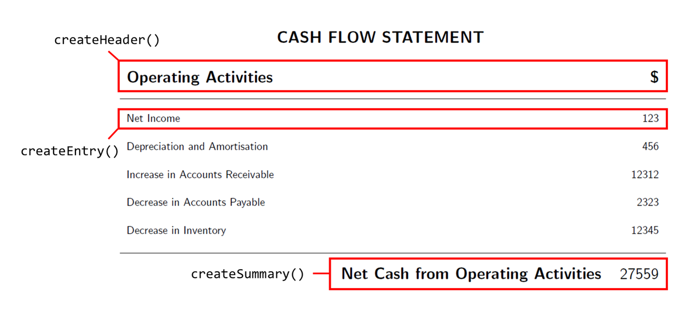<br>
</p>

#### Compiling the LaTeX code online
`createHeader()`, `createEntry()` and `createSummary()` also add the template to an `ArrayList` after performing the text replacement on the template. Iterating through the `ArrayList`, these templates are then appended together using `append()`.
This forms a long `String` which is then sent to the online LaTeX compiler via a POST request. The reply data obtained from the request is used to construct the PDF via the `write()` method of Java's `FileOutputStream` class.

[⬆️ Back to top](#whats-in-this-developer-guide)

<!--@@author fansxx-->

### Declaring an availability
The `MeetingManager` class facilitates the storing of availability in cOOPer.

#### Availability declaration process
When the user declares an availability, the `addAvailability` function in `MeetingManager` performs some checks before successfully storing their availability.
1. `addAvailability` looks at the format of the `[date]` and `[time]` entered, which will be checked using the `isValidDateTimeFormat` function.
2. `addAvailability` checks if the time entered is at the **start of the hour**, using the `isStartOfHour` function.
3. `addAvailability` checks if the user has already entered their availability under the same date and time, by checking all the names under the specified date and time in the `availability` TreeMap.

The following sequence diagram shows the detailed process of declaring an availability. `username` is `Sebastian` and `userInput` is `available 11-08-2021 14:00`.

<p align="center">
    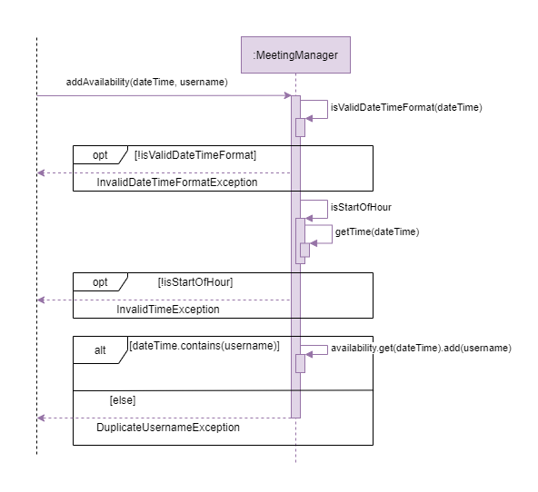<br>
</p>

[⬆️ Back to top](#whats-in-this-developer-guide)

### Scheduling a meeting
The `MeetingManager` class facilitates the scheduling of meetings.

#### Scheduling process
When the user schedules a meeting `ScheduleCommand` checks if the `[date]` and `[time]` parameter is entered and calls `manualScheduleMeeting` in `MeetingManager` if it is and `autoScheduleMeeting` if it isn't.

The following sequence diagram shows the process of **automatically** scheduling a meeting. `username` of the user scheduling is `Sebastian` and `userInput` is `schedule Project Meeting /with Eugene`.

<p align="center">
    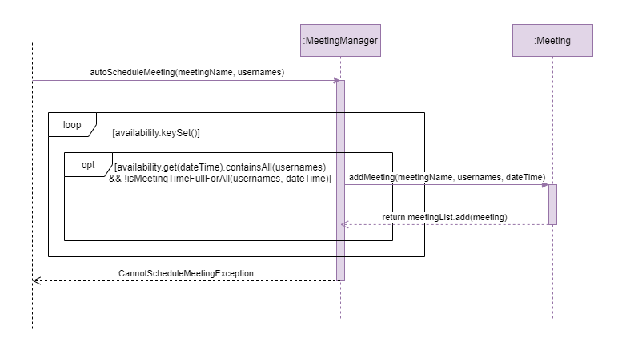<br>
</p>

The following sequence diagram shows the process of **manually** scheduling a meeting. `username` of the user scheduling is `Sebastian` and `userInput` is `schedule Project Meeting /with Eugene /at 11-08-2021 14:00`.

<p align="center">
    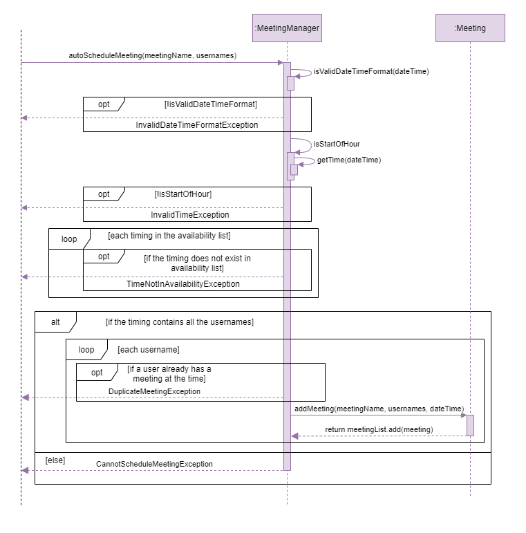<br>
</p>

[⬆️ Back to top](#whats-in-this-developer-guide)

<!--@@author Rrraaaeee-->

### Interacting with the forum

The following sequence diagram shows three operations with the forum, `addPost`, `commentPost` and `deletePost`.

+ For adding a post, `ForumManager` will create a new `ForumPost` object and store its username and content.

+ For commenting on a post, `ForumManager` will first check if the `postId` specified is a valid index. If it is not, an exception will be thrown. Otherwise, it will get the `ForumPost` by its `postId` and add a new `ForumComment` to it.

+ For deleting a post, `ForumManager` will again check the `postId` and delete the post only if the `postId` is valid.

  > ℹ️ In the actual implementation, `ForumManager` will also ensure the username of the user requesting for the `deletePost` operation matches the *owner* of the forum post. This checking is omitted in this sequence diagram for simplicity and represented as the method call to`remove(postId)`.


<p align="center">
    <br>
</p>

[⬆️ Back to top](#whats-in-this-developer-guide)

<!--@@author theeugenechong-->

### Saving and loading data
> ℹ️Due to the way the `Storage` component is implemented, the classes and methods used for storage have names which are quite similar. In order to generalize the explanations in this section for how data is saved and loaded, the term `XYZ` will be used as a placeholder where `XYZ` is `signInDetails`, `balanceSheet`, `cashFlowStatement`, `availability`, `meetings` and `forum`.

The `StorageManager` class facilitates the saving and loading of cOOPer's data to and from its storage files. This data includes the sign in details of registered users (from the [`Verification`](#verification-component) component) , entries of the balance sheet and cash flow statement, list of availabilities, scheduled meetings, and forum posts (all from the [`Resources`](#resources-component) component).
cOOPer's data is stored separately in multiple text files named `XYZ.txt` located in the 'cooperData' folder in the home folder.

#### Saving data
Certain commands, when executed successfully, can change the data in the `Verification` and `Resources` components. (e.g. `register`, `add`, `available`, etc.) Whenever the data in these components change, the command that made the change will call the `saveXYZ()` method of the `StorageManager` to update the storage file with the change. 
For example, when a new availability is added successfully, the method `saveAvailability()` is called by `AvailableCommand` and the storage file is updated with the new list of availabilities.

The following sequence diagram shows the general procedure of saving data to the storage file whenever a change is made.

<p align="center">
    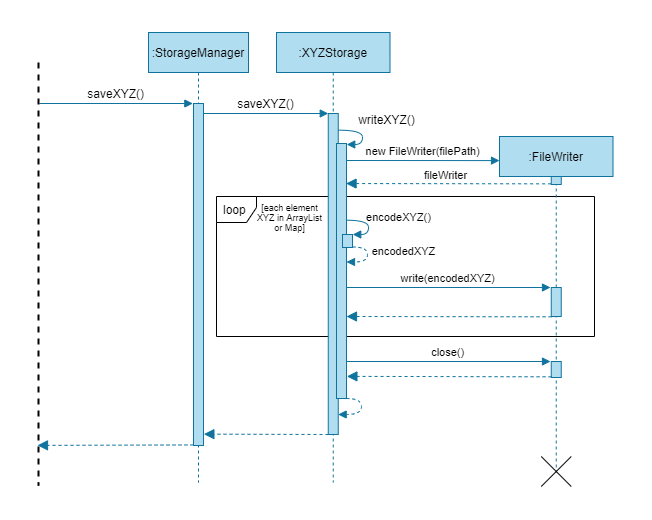<br>
</p>

#### Loading data
Data is loaded from cOOPer's storage files into the `Verification` and `Resources` component upon launching the app. The `StorageManager` constructor is first called and each subclass `XYZStorage` is initialized with the file paths of their storage files, `XYZ.txt`.
The `loadAllData()` method of `StorageManager` is then called and this method in turn calls the `loadXYZ()` methods of the `XYZStorage` subclasses. If the storage files are not present upon launching cOOPer, the storage files will be created and any error in file creation will be made known to the user. 
Since data in the storage files are of a specific format, any change to the storage format will throw an `InvalidFileDataException` and a message will be printed to specify the file containing invalid data. 

The following sequence diagram shows the general procedure of loading data from the storage file upon launching cOOPer.

<p align="center">
    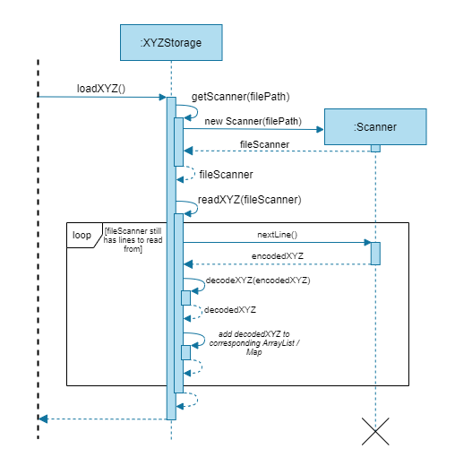<br>
</p>

#### Storage design considerations
**Current choice**: Individual subclasses which store the sign in details of registered users, entries of the balance sheet and cash flow statement, list of availabilities, scheduled meetings, and forum posts in separate storage files.
- Pros:
  - Easy to implement
  - Efficient (only saves the data changed for a specific component, not all)
  - Extensible (each subclass follows a certain template for storage)
- Cons:
  - Some methods are duplicated (e.g. `saveXYZ()`, `loadXYZ()`, etc.)

[⬆️ Back to top](#whats-in-this-developer-guide)

<div style="page-break-after: always;"></div>

<!--@@author ChrisLangton-->

## Appendix: Requirements

### Product scope

#### Target user profile

The target user profile of cOOPer consists of all levels of administration in a tech startup, namely from the employee level of Secretary up to the management level of CEO.

Example Users:
* has a need to schedule company meetings in timely manner
* has a need to generate and store financial statements
* has a need to raise timely concerns to management
* has a need to perform reliable company growth projections
* comfortable with typing interactions on a CLI

#### Value proposition

**cOOper's value proposition:** Manage company financials **faster** than typical human accounting means
& manage company communication **more reliably** than a typical GUI driven app.

### User Stories
> 💡 Priorities: High (must have) - `***`, Medium (nice to have) - `**`, Low (unlikely to have) - `*`

| Priority | As a ... | I want to ...             | So that I can ...                                           |
| ------- | -------- | ------------------------- | ----------------------------------------------------------- |
| `***`    | new user | see usage 'help' instructions    | refer to them when I forget how to use the application      |
| `***`    | new user     | register an account | login and return to my saved work at any point later on |
| `***`    | user     | see a list of roles at login | login to the specific role I need to carry out a task |
| `***`    | user     | have a password encrypted login | have my saved work be protected from any external tampering |
| `***`    | finance admin     | create the company's financial statements | assess the company's current financial health accurately and quickly |
| `***`    | secretary employee     | see all company personnel's daily availability | schedule meetings between all available members easily |
| `**`    | finance admin     | automatically generate projections on the company's yearly profitability | assess the company's potential future growth|
| `**` | finance admin | generate the company's financial statements as a PDF document | view and share a neat version of the financial statement with my colleagues
| `**`    | employee     | make posts on a company forum | discuss difficulties or interesting developments in the company |
| `**` | employee | add my available timings for meetings | ease the scheduling of meetings with my colleagues
| `**`    | secretary employee     | automatically schedule a meeting without having to know other person's availability| save time on finding an appropriate time to meet  |
| `*`    | user in a hurry     | customise shortcut keys in the app| save time on retrieving the data I desire  |

### Non-Functional Requirements

* Should work on any _mainstream OS_ with Java 11 or above installed.
* Should be able to store up to 100 meetings, forum posts, and financial statements without observing any noticeable sluggishness in performance.
* Should log in and enter user-specific roles faster than traditional web-applications.
* A user with average typing speed should be able to accomplish meeting scheduling and forum posting faster and more reliably using commands than using a mouse interaction GUI driven app.
* A user with average typing speed should also be able to accomplish financial statement creation faster than by human means or a mouse interaction GUI driven app. 

[⬆️ Back to top](#whats-in-this-developer-guide)

<div style="page-break-after: always;"></div>

<!--@@author theeugenechong-->

### Glossary

* *IDE* - Integrated Development Environment
* *JDK* - Java Development Kit
* *UML* - Unified Modelling Language
* *API* - Application Programming Interface
* *give-receive pattern* - A Java implementation of the ['friend' concept](https://en.cppreference.com/w/cpp/language/friend) in C++
* *POST Request* - A request used to send data to a server to create / update a resource
* *mainstream OS* - Windows, OS-X, Linux, Unix

[⬆️ Back to top](#whats-in-this-developer-guide)

<div style="page-break-after: always;"></div>

## Appendix: Instructions for Manual Testing

### Launch and shutdown
1. Launching cOOPer
   1. Download cOOPer's latest JAR file [here](https://github.com/AY2122S1-CS2113T-W13-4/tp/releases) and copy the JAR file into an empty folder.
   2. Launch the Command Prompt / Terminal from the folder.
   3. Check the Java version being used by entering `java -version`. Ensure that you are using Java 11 or above.
   4. Run `java -jar cOOPer.jar`. <br>
   **Expected output:** cOOPer's greeting message is shown.
2. Exiting cOOPer
   1. Enter `exit`.<br>
   **Expected output:** cOOPer's bye message is shown and the program exits successfully.

### Sign-in
1. Registering
   1. Ensure that the label beside cOOPer's command prompt shows `[Logged out]`.
   2. Enter `register [username] /pw [password] /as [role]` where `[username]` is your username, `[password]` is your password and `[role]` is one of 'admin' or 'employee'.<br>
   **Expected output:** A message informing you that you have successfully registered is shown.
2. Logging in
   1. Ensure that the label beside cOOPer's command prompt shows `[Logged out]`.
   2. Enter `login [username], /pw [password] /as [role]` where `[username]`, `[password]` and `[role]` are the username, password and role you registered with.<br>
   **Expected output:** A message informing you that you are now successfully logged in is shown. The `[Logged out]` label at the command prompt is no longer present.
   
### Viewing help
1. Viewing help
   1. Ensure that you are logged in to cOOPer.
   2. Enter `help`.<br>
   **Expected output:** A list of commands specific to your role is shown along with their formats.

<!--@@author ChrisLangton-->

### Finance actions
1. Creating the balance sheet
   1. Ensure that you are logged in as an *admin*.
   2. Enter `bs` to initiate the balance sheet function.
   3. Ensure that the label beside the command prompt shows `[Balance Sheet]`.
   4. Enter `add [amount]` to add the first entry. <br>
   **Expected output:** You will be prompted by cOOPer for the next entry.
   5. Repeat step iv until cOOPer prompts you to enter `list` upon completion of the balance sheet.
2. Viewing the balance sheet
   1. Ensure that you are logged in as an *admin*.
   2. Enter `bs` to initiate the balance sheet function.
   3. Ensure that the label beside the command prompt shows `[Balance Sheet]`.
   4. Enter `list` to view the current balance sheet. <br>
   **Expected output:** All entries will be displayed with the respective net amounts, as well as a check for if the sheet balances.
3. Creating the cash flow statement
   1. Ensure that you are logged in as an *admin*.
   2. Enter `cf` to initiate the cash flow statement function.
   3. Ensure that the label beside the command prompt shows `[Cash Flow]`.
   4. Enter `add [amount]` to add the first entry. <br>
   **Expected output:** You will be prompted by cOOPer for the next entry.
   5. Repeat step iv until cOOPer prompts you to enter `list` upon completion of the cash flow statement.
4. Viewing the cash flow statement
   1. Ensure that you are logged in as an *admin*.
   2. Enter `cf` to initiate the cash flow statement function.
   3. Ensure that the label beside the command prompt shows `[Cash Flow]`.
   4. Enter `list` to view the current cash flow statement. <br>
   **Expected output:** All entries will be displayed with the respective net amounts.
5. Generating cash flow projections
   1. Ensure that you are logged in as an *admin*.
   2. Ensure all the fields of the cash flow statement have been filled using `cf` → `add`.
   3. Enter `proj [years]` to project up to your specified number of years. <br>
   **Expected output:** All the projected values of free cash flow will be displayed up to the specified year.

<!--@@author theeugenechong-->

### Generating the PDF
The `generate` command works regardless of whether the prompt label is showing `[Balance Sheet]`, `[Cash Flow]` or is not even present.

1. Generating the balance sheet
    1. Ensure that you are logged in as an *admin*.
    2. Fill up the balance sheet with `bs` → `add`.
    3. Ensure that you have an active Internet connection.
    4. Enter `generate bs`.<br>
       **Expected output**: A message informing you that the PDF has been successfully generated is shown. A PDF named 'BalanceSheet.pdf' is created in a folder named 'output' in the folder containing the JAR file.
2. Generating the cash flow statement
    1. Ensure that you are logged in as an *admin*.
    2. Fill up the cash flow statement with `cf` → `add`.
    3. Ensure that you have an active Internet connection.
    4. Enter `generate cf`.<br>
       **Expected output**: A message informing you that the PDF has been successfully generated is shown. A PDF named 'CashFlowStatement.pdf' is created in a folder named 'output' in the folder containing the JAR file.

<!--@@author fansxx-->

### Meetings actions
1. Declaring availability
    1. Ensure that you are logged in to cOOPer.
    2. Enter `available [date in dd-MM-yyyy] [time in HH:mm]`.<br>
    **Expected output:** A confirmation informing you that your username has been added to the date and time is shown.
2. Viewing availability
    1. Ensure that you are logged in to cOOPer.
    2. Enter `availability`.<br>
   **Expected output:** A table with the availability of all users is shown.
3. Scheduling meeting
    1. Ensure that you are logged in to cOOPer.
    2. Ensure that you and one or more users have entered their availability at a common date and time.
    3. Enter `schedule [meetingName] /with [username]`. `[username]` is a user(not you) who is available in at least one common date and time as you.
    4. Alternatively, you can also enter `schedule [meetingName] /with [username] /at [date] [time]`. `[username]` and yourself must be both available at this date and time.<br>
   **Expected output:** A confirmation message informing you that the meeting is successfully scheduled is shown.
4. Viewing meetings
    1. Ensure that you are logged in to cOOPer.
    2. Enter `meetings`.<br>
   **Expected output:** A table with all your meetings, their date and time, and their attendees is shown.

<!--@@author Rrraaaeee-->

### Forum actions
1. Adding a post
   1. Ensure that you are logged in to cOOPer.
   2. Enter `post add hello world`.<br>
   **Expected output**: A box with the post you just added is shown as confirmation.
2. Commenting on a post
   1. Ensure that you are logged in to cOOPer.
   2. Ensure you have added at least one post.
   3. Enter `post comment hello world 2 /on 1`. <br>
   **Expected output**: A box with the post and your comment you just entered is shown as confirmation.
3. Deleting a post
   1. Ensure that you are logged in to cOOPer.
   2. Ensure you have added at least one post.
   3. Enter `post delete 1`. <br>
   **Expected output**: A box with the post you just deleted is shown as confirmation.
4. Listing all posts
   1. Ensure that you are logged in to cOOPer.
   2. Ensure you have added at least one post.
   3. Enter `post list all`.<br>
   **Expected output**: A box containing all posts and comments you have entered so far is shown.

<!--@@author theeugenechong-->

### Logging out
1. Logging out
   1. Ensure that you are logged in to cOOPer.
   2. Enter `logout`.
   **Expected output**: A message informing you that you have logged out of cOOPer is shown along with the instructions on how to log in, register or exit. The label at the command prompt now shows `[Logged out]`.

[⬆️ Back to top](#whats-in-this-developer-guide)
