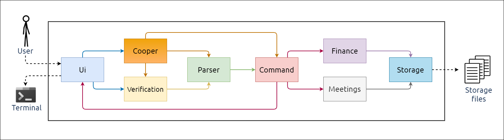
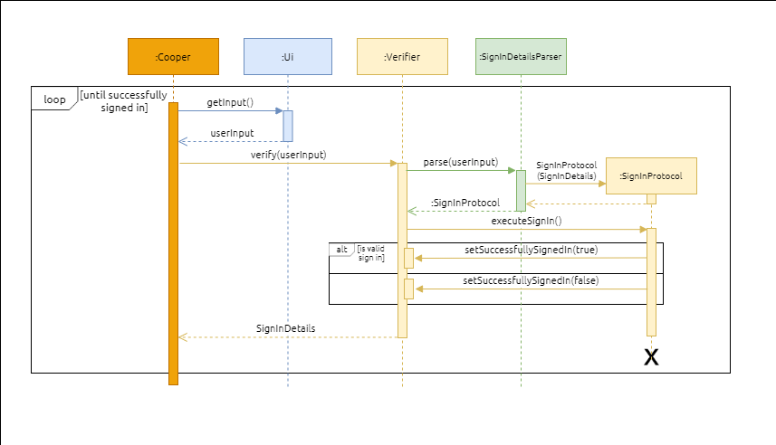
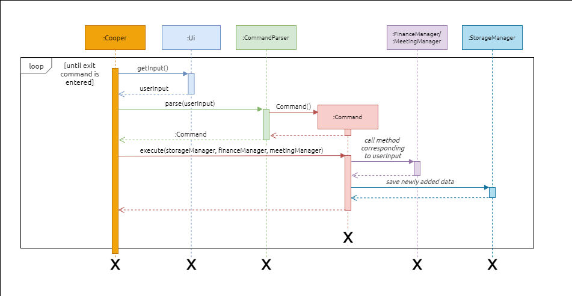

# Developer Guide

## Introducing cOOPer
cOOPer is a **Command Line Interface (CLI) desktop** application developed as a virtual assistant to simplify administrative processes of **tech startups** such as **communication** and **finance management**.

This developer guide is for software designers, developers, and software testers of cOOPer.

This developer guide will be your reference manual if you are looking to:
- Know more about cOOPer's internal software design
- Improve cOOPer's internal software design
- Extend features provided by cOOPer
- Enhance cOOPer's existing features
- Perform software testing on cOOPer

## What's in this Developer Guide
- [Acknowledgements](#Acknowledgements)
- [Setting Up andGetting Started](#setting-up-and-getting-started)
  - [Setting up cOOPer on your computer](#setting-up-cooper-on-your-computer)
  - [Before you code](#before-you-code)
- [Design](#design)

## Acknowledgements
{list here sources of all reused/adapted ideas, code, documentation, and third-party libraries -- include links to the original source as well}

## Setting Up and Getting Started

> #### 💡 Tip:
> Here are the software/tools used in developing cOOPer. You are recommended to use them :
> - **IDE**: IntelliJ IDEA (highly recommended)
> - **JDK**: Java 11 
> - **Version control**: Git 
> - **Git GUI**: Sourcetree
> - **Build system**: Gradle

### Setting up cOOPer on your computer
1. Fork [this repo](https://github.com/AY2122S1-CS2113T-W13-4/tp) and clone the fork into your computer.
2. If you are using IntelliJ IDEA, ensure that IntelliJ is configured to use **JDK 11**. You can refer to IntelliJ's
own documentation [here](https://www.jetbrains.com/help/idea/sdk.html#set-up-jdk) to correctly configure the JDK.
3. Import the project as a Gradle project. You can follow [this guide](https://se-education.org/guides/tutorials/intellijImportGradleProject.html) to find out how to import the project into IntelliJ.
4. Verify the setup by:
   1. Running `cooper.Cooper` and entering a few commands. You should be greeted by the following command prompt.
   
      ```bash
                  /$$$$$$   /$$$$$$  /$$$$$$$
                 /$$__  $$ /$$__  $$| $$__  $$
        /$$$$$$$| $$  \ $$| $$  \ $$| $$  \ $$ /$$$$$$   /$$$$$$
       /$$_____/| $$  | $$| $$  | $$| $$$$$$$//$$__  $$ /$$__  $$
      | $$      | $$  | $$| $$  | $$| $$____/| $$$$$$$$| $$  \__/
      | $$      | $$  | $$| $$  | $$| $$     | $$_____/| $$
      |  $$$$$$$|  $$$$$$/|  $$$$$$/| $$     |  $$$$$$$| $$
       \_______/ \______/  \______/ |__/      \_______/|__/
      ======================================================================
      Login or register to gain access to my features!
      To login, enter "login  [yourUsername] pw [password] as [yourRole]"
      To register, enter "register [yourUsername] pw [password] as [yourRole]"
      =========================================================================
      >>
      ```
   
   2. Running `junit` tests to ensure they all pass.

### Before you code
- **Configure coding style**
  - If you are using IntelliJ IDEA, follow [this guide](https://se-education.org/guides/tutorials/intellijCodeStyle.html)
  to set up IntelliJ to match our coding style.
- **Set up CI**
  - GitHub automatically detects the GitHub actions config file located in the `.github/workflows` folder. CI for cOOPer is automatically run at each push to the `master` branch or whenever a pull request is created.
- **Get to know cOOPer's design**
  - One last thing to know before you start coding is cOOPer's overall software design. You are recommended to get some sense of cOOPer's overall design in the [Design](#design) section below.

## Design 

### Architecture



The **Architecture Diagram** above shows the high-level design of cOOPer.

`Cooper` contains the *main* method of the program. `Cooper`'s responsibilities are as such:
- Upon **launching the app**, `Cooper` initializes the components and loads stored user data into the components. 
- While the **app is running**, `Cooper` reads user input which is then processed by the components to produce 
a result.
- Upon **shutting down the app**, `Cooper` saves any unsaved user data to the hard disk and shuts down the components. 

Apart from `Cooper` the rest of the app consists of these nine components:
- `Ui`: Handles the reading of user input and printing of messages to the terminal.
- `Parser`: Interprets and validates user input.
- `Verification`: Verifies that the user is signing in to the system with the correct credentials.
- `Command`: Executes commands which are parsed from user input.
- `Finance`: Handles finance-related data and operations of the app.
- `Meetings`: Handles data and operations of the app needed for scheduling meetings among users.
- `Forum`: Handles posts and comments created by users in the forum.
- `Resources`: Managers all resources such as `FinanceManager`, `MeetingsManager` and `ForumManager` and their related access rights based on user roles.
- `Storage`: Loads data from, and saves data to storage files in the computer hard disk.

#### Interaction of the architecture components to process user input
1. The *sequence diagram* below shows how cOOPer's components interact with each other when a user enters their **sign in 
details** for verification.

> #### 📝 Note:
> `userInput` represents the sign in details input by the user for verification. For example, `register 
> John pw 12345 as admin`.



2. The next sequence diagram below shows how cOOPer's components interact with each other when a user enters a **command** after
successfully logging in.

> #### 📝 Note:
> `userInput` represents a command input by the user. For example, `meetings`.



## Implementation

### Parser

`Parser` interprets and validate user inputs and construct objects for various actions such as `Command` and `SignInProtocol` objects.

#### Dopsun chatbot-cli

cOOPer's uses the [dopsun chatbot-cli](https://github.com/dopsun/chatbot-cli) library as its frontend parser that allows developer to define any arbitrary input schema under `src/main/resources/parser/command-data.properties` 
such as 

```
login = login ${username-hint} pw ${password-hint} as ${role-hint}
```

Parser library will then automatically parse the place-holders defined with `$` leaders to strings. For example `login Yvonne pw 12345 as admin` will be parsed 
into the following fields:

```python
{ "username-hint" : Yvonne,
  "password-hint" : 12345,
  "role-hint" : admin }
```

This gives us great flexibility and extensibility to the parser module as developers do not need to worry about writing new parsing scheme for every instruction and adding new instructions to frontend become trivial.

#### Parser module descriptions

cOOPer has two main parsers. `CommandParser` and `SignInDetailsParser` which are both inherited from `ParserBase` abstract class and are required to override abstract base function `parseInput(String input)`. 

##### CommandParser Class

`CommandParser` class will return a `Command` polymorphic base object which implements the `execute()` function. The details about the `Command` family classes are described in the next section.

##### SignInDetails Class

`SignInDetails` class will return a `SignInProtocol` polymorphic base object. `Login` and `Registration` classes are inherited from the `SignInProtocol` base class.

### Command

`Command` are action objects that implement the `execute()` methods for interacting with different resources such as the `FianceManager`and `MeetingsManager`.

#### Command module descriptions

As mentioned above, `CommandParser` returns a `Command` polymorphic base object. Any specialisation of the `Command` base object must implement the`execute()` abstract base method. For example, Developer can add a new command like `HelloCommand` by inheriting from the `Command` base class and implements the `execute()` function to print out `Hello world` as shown below.

```java
public class HelloCommand extends Command {
	// constructors and arguments to execute function are omitted
	public void execute() {
		System.out.println("Hello world");
	}
}
```

This allows developers to inherit any arbitrary number of different command specialisation with different 
behaviours using a unified driver. Developers do not need to modify the frontend to accomodate for every new commands.

### Forum 

`Forum` provides features like posting a forum thread, commenting on a post, listing posts. 

#### Forum module descriptions

`ForumManager` stores a list of `ForumPost`objects. Each `ForumPost` object stores a list of `ForumComment` objects. Both `ForumPost` and `ForumComment` need to store two attributes, username and content. When a user wants to delete a post or comment, `ForumManager` will check if the username of the post matches the user performing the action and deletion is successful only if these two are a match.

### Resources

`Resources` manages other manager modules like the `FinanceManager`, `MeetingsManager` and `ForumManager`.

#### Forum module descriptions

`ForumManager` grants reference to other manager modules for different `Command` objects to perform their execution functions  by checking the `UserRole`. For example, 

````java
FinanceManager financeManager = resourcesManager.getFinanceManager(userRole);
````

will return a `FinanceManager` object only if `userRole` is an `admin`. Otherwise a `null` will be returned indicating the use does not have the access right to that module.

## Product scope

### Target user profile

{Describe the target user profile}

### Value proposition

{Describe the value proposition: what problem does it solve?}

## User Stories

| Version | As a ... | I want to ...             | So that I can ...                                           |
| ------- | -------- | ------------------------- | ----------------------------------------------------------- |
| v1.0    | new user | see usage instructions    | refer to them when I forget how to use the application      |
| v2.0    | user     | find a to-do item by name | locate a to-do without having to go through the entire list |

## Non-Functional Requirements

{Give non-functional requirements}

## Glossary

* *glossary item* - Definition

## Instructions for manual testing

{Give instructions on how to do a manual product testing e.g., how to load sample data to be used for testing} 
