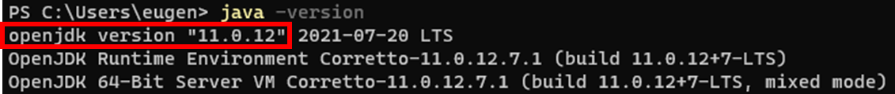
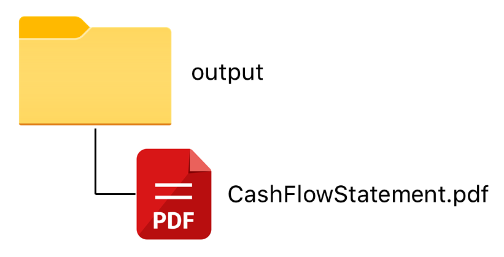
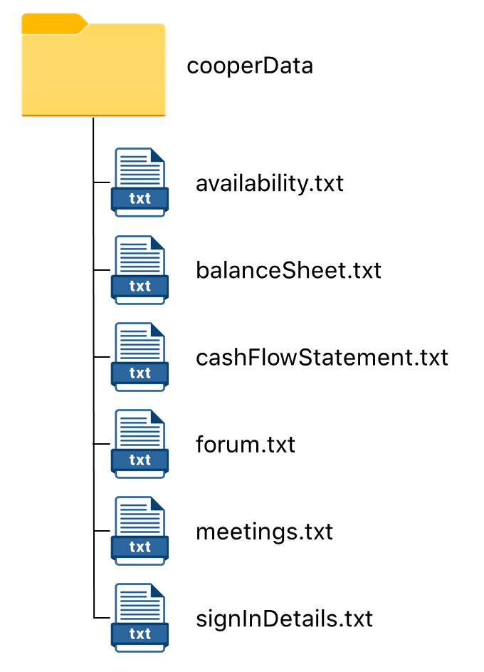

<!--@@author theeugenechong-->

# User Guide

## Introducing cOOPer

Welcome to cOOPer's User Guide!

cOOPer is a **desktop application** developed to simplify administrative processes of **tech startups**
such as **communication** and **finance management**.

If you are running a tech startup, cOOPer can help you with **accounting** and **communicative** tasks like:
- **Generating** your company's **financial statements**
- **Forecasting** your company's **cash flow**
- **Scheduling meetings** with your employees
- Having **discussions** with your colleagues

cOOPer  is optimized for use via a [**Command Line Interface (CLI)**](https://simple.wikipedia.org/wiki/Command-line_interface), so if you are someone who types fast,
cOOPer can help you manage your startup efficiently.

This user guide is written to assist users like you in using cOOPer. It provides you with the necessary guidance you need for using cOOPer's features to manage your startup.

<div style="page-break-after: always;"></div>

## What's in This User Guide

- [How this User Guide Works](#how-this-user-guide-works)
- [Setup](#setup)
- [cOOPer's Commands](#coopers-commands)
- [Getting Started](#getting-started)
  - [How cOOPer is to be used](#how-cooper-is-to-be-used)
  - [Roles](#roles) 
  - [User registration](#user-registration)
- [Login](#login)
- [Features for All Users](#features-for-all-users)
  - [Adding a forum post: `post add`](#adding-a-forum-post-post-add)
  - [Viewing a post / posts in the forum: `post list`](#viewing-a-post--posts-in-the-forum-post-list)
  - [Commenting on a forum post: `post comment`](#commenting-on-a-forum-post-post-comment)
  - [Deleting a forum post: `post delete`](#deleting-a-forum-post-post-delete)
  - [Declaring available timings for meetings: `available`](#declaring-available-timing-for-meetings-available)
  - [Viewing users available at different timings: `availability`](#viewing-users-available-at-different-timings-availability)
  - [Viewing scheduled meetings: `meetings`](#viewing-scheduled-meetings-meetings)
  - [Logging out: `logout`](#logging-out-logout)
- [Admin Features](#admin-features)
  - [Creating the balance sheet: `bs` → `add`](#creating-the-balance-sheet-bs--add)
  - [Creating the cash flow statement: `cf` → `add`](#creating-the-cash-flow-statement-cf--add)
  - [Accessing the balance sheet: `bs` → `list`](#accessing-the-balance-sheet-bs--list)
  - [Accessing the cash flow statement: `cf` → `list`](#accessing-the-cash-flow-statement-cf--list)
  - [Projecting cash flow: `proj`](#projecting-cash-flow-proj)
  - [Generating a PDF from the financial statement: `generate`](#generating-a-pdf-from-the-financial-statement--generate)
  - [Scheduling meetings with different users: `schedule`](#scheduling-meetings-with-different-users-schedule)
- [Employee Features](#employee-features)
- [Viewing Help: `help`](#viewing-help-help)
- [Exiting the Program: `exit`](#exiting-the-program-exit)
- [cOOPer's Data Storage](#coopers-data-storage)
- [FAQ](#faq)
- [Command Summary](#command-summary)
  - [Before logging in](#before-logging-in)
  - [Admin commands](#admin-commands)
  - [Employee commands](#employee-commands)

<div style="page-break-after: always;"></div>

## How this User Guide Works

Throughout this user guide, you will see text formatted differently from normal text, as well as symbols appearing before another line of text. 
The table below explains the formatting and symbols in this user guide.

**Formatting/Symbol** | **Meaning**              |
------------|------------------------------------|
*italics* |Text in italics represent special terminology specific to using cOOPer.
**bold**|Text in bold emphasizes the text's importance and indicates that you should pay more attention to the text.
<kbd>key</kbd> | Text formatted as such represents a key you can press on your keyboard. 
`command` |Short lines of text highlighted as such represent a command that can be entered in the Command Prompt/Terminal.<br> Large segments on the other hand (for e.g. in [Setup](#setup)) represent the expected output on the Command Prompt/Terminal.
`[argument]`|Text highlighted in grey wrapped in square brackets represent a command argument that needs to be present when a command is entered. You are free to decide the argument entered. 
`>>`|This symbol appears in the examples given for cOOPer's features. It represents cOOPer's [command prompt](https://en.wikipedia.org/wiki/Command-line_interface#Command_prompt) and it should not be included when you enter subsequent commands.<br> Refer to the [cOOPer's Commands](#coopers-commands) section for additional info regarding the prompt.
ℹ️  |The info symbol indicates useful information about cOOPer's features.
💡     |The light bulb symbol indicates a useful tip which eases your usage of cOOPer. 
⚠️  |The hazard symbol indicates an important message you should take note of in order to avoid negative consequences.


[⬆️ Back to top](#whats-in-this-user-guide)

<div style="page-break-after: always;"></div>

## Setup

1. Download the latest version of cOOPer [here](https://github.com/AY2122S1-CS2113T-W13-4/tp/releases).
2. Copy the JAR (.jar) file to an empty folder of your choice. This folder will be used as the *home folder* for your cOOPer application.
3. If you are using Windows, [launch the Command Prompt](https://www.lifewire.com/open-command-prompt-in-a-folder-5185505)
   in the home folder. If you are using Mac or Linux, [open a Terminal window](https://www.groovypost.com/howto/open-command-window-terminal-window-specific-folder-windows-mac-linux/#:~:text=To%20open%20a%20Terminal%20window%20from%20within%20a%20folder%20in,window%20to%20the%20selected%20folder.) 
   in the home folder.
4. Ensure that you have Java 11 or above installed or your desktop.
   1. In the Command Prompt / Terminal, enter `java -version`.
   2. You should see the following on the Command Prompt / Terminal:
   
   3. The section enclosed in red shows you the version you currently have installed.
   4. If nothing appeared on the Command Prompt / Terminal, it most likely means you do not have Java installed on your computer. Do not worry, you can download it [here](https://docs.aws.amazon.com/corretto/latest/corretto-11-ug/downloads-list.html).
5. Run cOOPer by entering `java -jar cOOPer.jar`.
6. A greeting from cOOPer should appear as such:

```
            /$$$$$$   /$$$$$$  /$$$$$$$
           /$$__  $$ /$$__  $$| $$__  $$
  /$$$$$$$| $$  \ $$| $$  \ $$| $$  \ $$ /$$$$$$   /$$$$$$
 /$$_____/| $$  | $$| $$  | $$| $$$$$$$//$$__  $$ /$$__  $$
| $$      | $$  | $$| $$  | $$| $$____/| $$$$$$$$| $$  \__/
| $$      | $$  | $$| $$  | $$| $$     | $$_____/| $$
|  $$$$$$$|  $$$$$$/|  $$$$$$/| $$     |  $$$$$$$| $$
 \_______/ \______/  \______/ |__/      \_______/|__/
=========================================================================
Hello I'm cOOPer! Nice to meet you!
=========================================================================
Log in or register to gain access to my features!
To log in, enter "login [yourUsername] pw [password] as [yourRole]".
To register, enter "register [yourUsername] pw [password] as [yourRole]".

To exit, enter "exit".
=========================================================================
>> [Logged out]
```

Refer to the [Getting Started](#getting-started) section for information on how to start using cOOPer.

[⬆️ Back to top](#whats-in-this-user-guide)

<div style="page-break-after: always;"></div>

## cOOPer's Commands

ℹ️Here are some things to note about cOOPer's **commands**.<br>

- Extraneous arguments for commands that do not have arguments (e.g. `exit`, `meetings`, `cf`, `help`, etc.) will be **ignored**. For example, `exit 123` will be interpreted as `exit`.<br>
- For commands having arguments, extraneous arguments added to the back of the command **will be considered as part of the command argument** too, and this may lead to the command **not being interpreted correctly** by cOOPer. For example, if `available 14:00 abc` is entered, cOOPer interprets the argument as `14:00 abc` which according to cOOPer is an invalid time.<br>
- All commands are **case-insensitive**. For example, `list` is the same as `List` or `LIST`.<br>
- Empty input (for e.g. simply pressing <kbd>Enter</kbd>, entering whitespaces or <kbd>Tab</kbd> characters) will be ignored and cOOPer will continue prompting you for your next command.<br>

ℹ️Here is some additional information about cOOPer's **command prompt**.<br>

- At different stages of using cOOPer, an additional label which looks like `[label]` will appear beside the prompt.<br> 
- There are **three** types of labels you will see:
  - `[Logged out]` indicates you are currently **logged out** of cOOPer
  - `[Balance Sheet]` indicates you are using cOOPer's **[balance sheet](#creating-the-balance-sheet-bs--add) function**
  - `[Cash Flow]` indicates you are using cOOPer's **[cash flow](#creating-the-cash-flow-statement-cf--add) function**
- No label shown indicates you are **logged in** to the cOOPer, but you are using **neither** the balance sheet function nor the cash flow statement function.

[⬆️ Back to top](#whats-in-this-user-guide)

<div style="page-break-after: always;"></div>

## Getting Started

### How cOOPer is to be used
- The **correct** way (as of v2.1) of using cOOPer is to run cOOPer on a **single** desktop with only **a single user** interacting with cOOPer at a time.
> ⚠️cOOPer's features **will not work** as described in this user guide if **multiple users** are interacting with cOOPer on **multiple desktops** at the same time.

### Roles
- There are two main roles you can hold as a user of cOOPer, namely the _**admin**_ role or the _**employee**_ role.

- You are eligible to hold the admin role if you hold a high position in the startup. e.g. Chief Executive Officer (CEO), Chief Financial Officer (CFO), Human Resources Manager (HR), accountant etc.

- On the other hand, you hold the employee role if you are a basic employee at the startup.

- cOOPer offers tailor-made functions and features specific to your role to ensure the correct level of administrative access within the company throughout cOOPer's usage.

### User registration
- Upon first-time use of cOOPer, an individual holding the admin role in the startup is in charge of ensuring all members of the startup are registered with the correct role.

- Once a member has been registered, they will be able to log in to cOOPer to access its features.

- How to register a user:
  1. When you see cOOPer asking you to log in, register or exit, enter `register [username] /pw [password] /as [role]`. 
  2. Upon successful registration, you should see a message informing you of your successful registration.
  3. You can now log in to access cOOPer's features specific to your role. Refer to the [Login](#login) section to find out more about logging in.

> ℹ️`[username]` refers to your name, `[password]` refers to your password, while `[role]` refers to your role as determined [here](#roles).

- Example input:

```
>> [Logged out] register Sebastian /pw 123 /as admin
```

- Expected output:

```
=========================================================================
Sebastian is now successfully registered as an admin!
=========================================================================
```

> ℹ️A similar output should be observed when an employee is registered, with the output now showing 'employee' instead of 'admin'.<br>
> 💡 Just like when you are using any other app with a sign in feature, remember to record down your username and password somewhere (e.g. Sticky Notes, a password manager).<br>

[⬆️ Back to top](#whats-in-this-user-guide)

## Login
- Once you are successfully [registered](#user-registration), you can now log in to access cOOPer's features.
- How to log in:
  1. When you see cOOPer asking you to log in, register or exit, enter `login [username] /pw [password] /as [role]`.
  2. You now have access to cOOPer's features specific to your role.

> ℹ️`[username]`, `[password]` and `[role]` refer to your name, password and role as registered in cOOPer's system.<br>
> ⚠️The username you are logging in with is **case-sensitive**. *e.g.* logging in with the username `sebastian` is not the same as logging in with `Sebastian`.

- Example input:

```
>> [Logged out] login Sebastian /pw 123 /as admin
```

- Expected output:

```
=========================================================================
You are now logged in successfully as Sebastian!
=========================================================================
```


[⬆️ Back to top](#whats-in-this-user-guide)

<div style="page-break-after: always;"></div>

## Features for All Users

- This section explains cOOPer's features for all users, i.e. users with either the _**admin**_ role or the _**employee**_ role. Refer to the [Roles](#roles) section if you do not know how roles are determined.
- These features are accessible to you only **after** you have successfully [logged in](#login).

<!--@@author Rrraaaeee-->

### Adding a forum post: `post add`

+ You can post a message to forum for cOOPer's users to discuss certain topics.
+ How to post a message to the forum:
  1. Enter `post add [postContent]`.
  2. Your post will be added to the forum, and you will see a confirmation message indicating that the post was successful.

> ℹ️`[postContent]` refers to the content of your post.

+ Example input:

```
>> post add hello world!
```

+ Expected output:

```
=========================================================================
Sebastian has just posted to the forum:
+--------------------------------------------------------------------+
|  hello world!
+--------------------------------------------------------------------+
=========================================================================
```

[⬆️ Back to top](#whats-in-this-user-guide)

### Viewing a post / posts in the forum: `post list`
+ Shows you the currently active forum posts along with any comments on the posts.
+ You can specify if you want to view all the posts or a specific post.
+ How to view a specific post / posts in the forum:
  1. Enter `post list all` to view all the active forum posts.
  2. cOOPer lists all posts along with their comments in a hierarchical manner.
  3. Enter `post list [postId]` to view the single post with `[postId]`.

> ℹ️`[postId]` refers to the index of the post you want to view. It must be a **positive integer** and also an index of the posts **in the list**.<br>
> 💡 Enter `post list all` to know the index of the specific post you want to view.

+ Example input for viewing all the forum posts:

```
>> post list all
```

+ Expected output:

```
=========================================================================
Here is the list of forum posts:
+--------------------------------------------------------------------+
|  1. @Sebastian: hello world!
|    -  1. @Eugene: welcome
|    -  2. @Eugene: welcome to CS2113T!
|  2. @Sebastian: how do you do?
|    -  1. @Eugene: how do you do?
|  3. @Eugene: Hey how are you?
+--------------------------------------------------------------------+
=========================================================================
```

+ Example input for viewing a specific forum post:

```
>> post list 1
```

+ Expected output:

```
=========================================================================
Here is the forum post:
+--------------------------------------------------------------------+
|  @Sebastian: hello world!
|    -  1.@Eugene: welcome
|    -  2.@Eugene: welcome to CS2113T!
+--------------------------------------------------------------------+
=========================================================================
```

[⬆️ Back to top](#whats-in-this-user-guide)

### Commenting on a forum post: `post comment`
+ Adds a comment on a post in the forum.
+ How to comment on a post:
  1. When you see a post on the forum, comment on the post by entering `post comment [commentContent] /on [postId]`.
  2. A comment `[commentContent]` will be added to the post with `[postId]`.

> ℹ️`[postId]` refers to the index of the post you want to comment on. It must be a **positive integer** and also an index of the posts **in the list**.<br>
> 💡 Enter [`post list all`](#viewing-a-post--posts-in-the-forum-post-list) before commenting on a post to know the index of the specific post you want to comment on.

+ Example input:

```
>> post comment welcome /on 1
```

+ Expected output:

```
=========================================================================
Eugene has just commented on a post from the forum:
+--------------------------------------------------------------------+
|  hello world!
|    -  welcome
+--------------------------------------------------------------------+
=========================================================================
```

[⬆️ Back to top](#whats-in-this-user-guide)

### Deleting a forum post: `post delete`
- Deletes an active post on the forum along with its comments.
- How to delete a post:
  1. Enter `post delete [postId]`.
  2. The post will be deleted from the forum.

> ℹ️ You are only allowed to delete the posts **made by you**.<br>
> ℹ️ `[postId]` refers to the index of the post you want to delete. It must be a **positive integer** and also an index of the posts **in the list**.<br>
> 💡 Enter [`post list all`](#viewing-a-post--posts-in-the-forum-post-list) before you delete a post to know the index of the post you want to delete.

- Example input:

```
>> post delete 1
```

- Expected output:

```
=========================================================================
Sebastian has just deleted a post from the forum:
+--------------------------------------------------------------------+
|  hello world!
+--------------------------------------------------------------------+
=========================================================================
```

[⬆️ Back to top](#whats-in-this-user-guide)

<!--@@author fansxx-->

### Declaring available timing for meetings: `available`
- For easier scheduling of meetings, cOOPer has a function to gather availabilities of everybody to find a common time for a meeting.
- How to input your availability:
  1. Enter `available [date] [time]`.
  2. You will now have your name stored under the specified time in the system.

> ℹ️`[time]` refers to the **start of the hour** that you are available at. For example, `available 14:00` means that you are available from **14:00** to **14:59**.<br>
> ⚠️`[date]` has a format of **dd-MM-yyyy**. Any other format will **not** be accepted and your availability will not be stored. <br>
> ⚠️`[time]` has a format of **HH:mm**, in *24-hour clock*. Any other format will **not** be accepted and your availability will not be stored.<br>
> ⚠️Duplicate `[username]` in one timeslot will **not** be accepted.

- Example input:

```
>> available 08-11-2021 14:00
```

- Expected output:

```
=========================================================================
Success!
Sebastian's availability has been added to 08-11-2021 14:00
=========================================================================
```

[⬆️ Back to top](#whats-in-this-user-guide)

### Viewing users available at different timings: `availability`
- To view all the availabilities after inputting [availabilities](#declaring-available-timing-for-meetings-available), cOOPer will generate a table for easier visualisation.
- How to view available timings:
  1. Enter `availability`.
  2. You will now see a table with the availabilities entered.

- Example input:

```
>> availability
```

- Expected output:

```
=========================================================================
Here are the availabilities:
+------------+-------+-----------------------------------------------+
| date       | time  | names
+------------+-------+-----------------------------------------------+
| 08-11-2021 | 10:00 | Eugene
| 08-11-2021 | 14:00 | Sebastian
+------------+-------+-----------------------------------------------+
=========================================================================
```

[⬆️ Back to top](#whats-in-this-user-guide)

### Viewing scheduled meetings: `meetings`
- Shows you your meetings (for the day) which have been scheduled successfully for easier visualisation. Refer to [this](#scheduling-meetings-with-different-users-schedule) section to know how meetings are scheduled.
- How to view meetings:
  1. After a meeting has been scheduled successfully, enter `meetings`.
  2. You will now see a table with all your meetings with date and time.

- Example input:

```
>> meetings
```

- Expected output:

```
=========================================================================
Here are your meetings for today:
+----------------------+------------+-------+------------------------+
| meeting              | date       | time  | attendees
+--------------------------------------------------------------------+
| <<Progress Meeting>> | 08-11-2021 | 10:00 | Eugene, Sebastian
+----------------------+------------+-------+------------------------+
=========================================================================
```

[⬆️ Back to top](#whats-in-this-user-guide)

<!--@@author theeugenechong-->

### Logging out: `logout`
- Logs you out of your account and brings you back to the part of the app where you can either [log in](#login), [register](#user-registration) or [exit](#exiting-the-program-exit).
- Example input:

```
>> logout
```

- Expected output:

```
=========================================================================
You are now logged out!
To log in, enter "login [yourUsername] /pw [password] /as [yourRole]".
To register, enter "register [yourUsername] /pw [password] /as [yourRole]".

To exit, enter "exit".
=========================================================================
```

[⬆️ Back to top](#whats-in-this-user-guide)

<div style="page-break-after: always;"></div>

## Admin Features 
This section explains cOOPer's features for specific to users, with the _**admin**_ role. Refer to the [Roles](#roles) section if you do not know how roles are determined. cOOPer will **deny** users without the admin role access to these features.

<!--@@author ChrisLangton-->

### Creating the balance sheet: `bs` → `add`
- Fills up the different fields of cOOPer's balance sheet like 'Cash and Cash Equivalents', 'Inventory', 'Accounts Payable', 'Equity Capital', etc.
- How to create the balance sheet:
  1. Enter `bs`.
  2. cOOPer initiates the balance sheet function and prompts you to enter the first entry, 'Cash and Cash Equivalents'.
  3. Enter `add [amount]` as an unsigned integer with no brackets.
  4. `[amount]` will be added as 'Cash and Cash Equivalents' as an **asset**.
  5. cOOPer then continues prompting you for the rest of the balance sheet fields. All assets should be added without brackets, and all liabilities should be added with brackets. Shareholder's Equity can be with or without brackets. To see which fields belong where, see [here](#accessing-the-balance-sheet-bs--list).
  6. When the balance sheet is complete, cOOPer prompts the user to enter [`list`](#accessing-the-balance-sheet-bs--list) to view the complete balance sheet.

> ℹ️ By default, cOOPer treats `[amount]` as a positive integer. To specify a negative integer, a pair of parentheses should be added around `[amount]`. For example, `add 5000` specifies an asset of $5000 while `add (5000)` specifies a liability of $5000.<br>
> ℹ️ `[amount]` should be an **unsigned integer** representing the amount of assets / liabilities added as the balance sheet field.<br>
> 💡    Remember to enter `bs` before entering `add` or cOOPer will not know which financial statement to add to.<br>
> ⚠️Running `bs` and `add` after the balance sheet is complete will **overwrite** the current fields of the balance sheet one by one, creating a *new version* of the balance sheet. Hence, it is important to add the balance sheet fields to **completion**. <br>
> ℹ️ Any entries more than or equal to 1 Billion SGD (positive or negative) will not be added.

- Example input for initiating the balance sheet function:

```
>> bs
```

- Expected output:

```
=========================================================================
You are now using the Balance Sheet function.
You can enter 'list' to view the current Balance Sheet or
start off by entering Cash & Cash Equivalents:
=========================================================================
```

- Example input for adding to 'Cash and Cash Equivalents':

```
>> [Balance Sheet] add 1500
```

- Expected output: 

```
=========================================================================
Success!
+1500 has been added as Cash and Cash Equivalents

Next, please enter Accounts Receivable
=========================================================================
```

[⬆️ Back to top](#whats-in-this-user-guide)

### Creating the cash flow statement: `cf` → `add`
- Fills up the different fields of cOOPer's cash flow statement like 'Net Income', 'Depreciation and Amortisation', 'Capital Expenditures', 'Dividends Paid', etc.
- How to create the cash flow statement:
  1. Enter `cf`.
  2. cOOPer initiates the cash flow statement function and prompts you to enter the first entry, 'Net Income'.
  3. Enter `add [amount]`.
  4. `[amount]` will be added as 'Net Income'.
  5. cOOPer then continues prompting you for the rest of the cash flow statement fields.
  6. When the cash flow statement is complete, cOOPer prompts the user to enter [`list`](#accessing-the-cash-flow-statement-cf--list) to view the complete cash flow statement.

> ℹ️ By default, cOOPer treats `[amount]` as a positive integer. To specify a negative integer, a pair of parentheses should be added around `[amount]`. For example, `add 5000` specifies an inflow of $5000 while `add (5000)` specifies an outflow of $5000.<br>
> ℹ️ `[amount]` should be a **positive integer** representing the amount of inflow / outflow added as the cash flow statement field.<br>
> 💡    Remember to enter `cf` before entering `add` or cOOPer will not know which financial statement to add to.<br>
> ⚠️Running `cf` and `add` after the cash flow statement is complete will **overwrite** the current fields of the cash flow statement one by one, creating a *new version* of the cash flow statement. Hence, it is important to add the cash flow statement fields to **completion**. <br>
> ℹ️ Any entries more than or equal to 1 Billion SGD (positive or negative) will not be added.

- Example input for initiating the cash flow statement function:

```
>> cf
```

- Expected output:

```
=========================================================================
You are now using the Cash Flow function.
You can enter 'list' to view the current Cash Flow Statement or
start off by entering Net Income:
=========================================================================
```

- Example input for adding to 'Net Income':


```
>> [Cash Flow] add 1500
```

- Expected output:

```
=========================================================================
Success!
+1500 has been added as Net Income

Next, please enter Depreciation and Amortisation
=========================================================================
```

[⬆️ Back to top](#whats-in-this-user-guide)

### Accessing the balance sheet: `bs` → `list`
- Displays the complete balance sheet with extra fields like 'Total Assets', 'Total Liabilities' and 'Total Shareholder's Equity'.
- Informs you if the balance sheet does not tally correctly.
- How to view the balance sheet:
  1. After [creating the balance sheet](#creating-the-balance-sheet-bs--add), cOOPer would have prompted you to enter `list` to view the balance sheet.
  2. Enter `list`.

> 💡 Remember to fill up the fields of the balance sheet with `add` before entering `list`.<br>
> ℹ️`list` displays the *latest version* of the balance sheet. Refer to [this](#creating-the-balance-sheet-bs--add) section to know what *latest version* means.<br>
> ℹ️Entering `list` while the balance sheet is incomplete will display the latest values for the fields already filled along with the old values for unfilled fields.<br>
> ℹ️The check can only inform you if the statement does or does not tally, and not which entry is incorrect as that comes down to human error.<br>
> ℹ️ Any scalar values more than or equal to 1 Billion SGD (positive or negative) will be displayed as such, and not as their exact values.
- Example input:

```
>> [Balance Sheet] list
```

- Expected output:

```
=========================================================================
This is the company's current Balance Sheet:
-----ASSETS-----
Cash and Cash Equivalents  1500
Accounts Receivable  1500
Prepaid Expenses  1500
Inventory  1500
Property and Equipment  1500
Goodwill  1500
Total Assets: 9000
-----LIABILITIES-----
Accounts Payable  1500
Accrued Expenses  1500
Unearned Revenue  1500
Long-term debt  1500
Total Liabilities: 6000
-----SHAREHOLDER'S EQUITY-----
Equity Capital  1500
Retained Earnings  1500
Total Shareholder's Equity: 3000
Balance Sheet is perfectly balanced, as all things should be.
Check: 0
=========================================================================
```

[⬆️ Back to top](#whats-in-this-user-guide)

### Accessing the cash flow statement: `cf` → `list`
- Displays the complete cash flow statement with extra fields like 'Net Cash from Operating Activities', Net Cash from Investing Activities' and 'Net Financing Activities'.
- How to view the cash flow statement:
  1. After [creating the cash flow statement](#creating-the-cash-flow-statement-cf--add), cOOPer would have prompted you to enter `list` to view the balance sheet.
  2. Enter `list`.

> 💡 Remember to fill up the fields of the cash flow statement with `add` before entering `list`.<br>
> ℹ️`list` displays the *latest version* of the cash flow statement. Refer to [this](#creating-the-cash-flow-statement-cf--add) section to know what *latest version* means.<br>
> ℹ️Entering `list` while the cash flow statement is incomplete will display the latest values for the fields already filled along with the old values for unfilled fields. <br>
> ℹ ️Any scalar values more than or equal to 1 Billion SGD (positive or negative) will be displayed as such, and not as their exact values.

- Example input:

```
>> [Cash Flow] list
```

- Expected output:

```
=========================================================================
This is the company's current Cash Flow Statement:
-----CASH FLOW FROM OPERATING ACTIVITIES-----
Net Income  1000
Depreciation and Amortisation  900
Increase in Accounts Receivable  800
Decrease in Accounts Payable  700
Decrease in Inventory  600
Net Cash from Operating Activities:  4000
-----CASH FLOW FROM INVESTING ACTIVITIES-----
Capital Expenditures  500
Proceeds from Sale of Equipment  400
Net Cash from Investing Activities:  900
-----CASH FLOW FROM FINANCING ACTIVITIES-----
Proceeds from Issuing Debt  300
Dividends Paid  200
Net Cash from Financing Activities:  500
-----FREE CASH FLOW-----
Free Cash Flow   3000
=========================================================================
```

[⬆️ Back to top](#whats-in-this-user-guide)

### Projecting cash flow: `proj`
- Generate projections on your company's 'Free Cash Flow' (FCF).
- How to generate a projection:
  1. [Fill up the cash flow statement](#creating-the-cash-flow-statement-cf--add) with last year's FCF.
  2. Enter `proj [years]` to project your company's FCF marginal growth Year-Over-Year (YoY) by the number of `[years]` specified. 

> ℹ️FCF is the last field of the cash flow statement.

- Example input based on a FCF of 3000:

```
>> proj 3
```

- Expected output:

```
=========================================================================
At your current rate of profitability growth in Free Cash Flow, these are future year's projections:
1 year: 5557
2 year: 7564
3 year: 8825
After 3 years you can expect Free Cash Flow of 8825
=========================================================================
```

[⬆️ Back to top](#whats-in-this-user-guide)

<!--@@author theeugenechong-->

### Generating a PDF from the financial statement : `generate`
- Creates a Portable Document Format (PDF) file from the *latest version* of the financial statement specified (balance sheet or cash flow statement).
- How to generate the PDF file:
  1. Enter `generate [financialStatement]` where `[financialStatement]` is one of `bs` or `cf`.
  2. If **successful**, the PDF file is created in a folder named 'output' in the _home folder_ with the name of the financial statement you generated. For example, `generate cf` will create a PDF named 'CashFlowStatement'.
  
- Example input for successful generation of the cash flow statement PDF:

```
>> generate cf
```

- Expected output:

```
=========================================================================
The pdf file has been successfully generated!
=========================================================================
```

- The diagram below shows where you can find the generated PDF file.

<p align="center">
    <br>
</p> 

> ℹ️You **do not** need to be currently using the balance sheet function or the cash flow statement function in order to use this command. <br>
> 💡   Always [**fill up** the balance sheet](#creating-the-balance-sheet-bs--add) / [cash flow statement](#creating-the-cash-flow-statement-cf--add) first before generating it as a PDF.<br>
> ℹ️As of v2.1, `generate` is only able to create **one** document for a financial statement. Entering `generate` more than one time overwrites the current PDF with the latest version of the financial statement.
>
> ⚠️ **Important:** <br>
>- The creation of the PDF requires an **active internet connection**. 
>- In the event that there is no internet connection, a backup '.txt' file will be created in the same 'output' folder in which the PDF was supposed to be created.
>- The contents of the backup '.txt' file created can be used to recreate the PDF file with the use of an [online LaTeX Editor](https://www.overleaf.com/). <br>
>
> 💡 **Always** ensure that you have an active internet connection before using the `generate` command. 

[⬆️ Back to top](#whats-in-this-user-guide)

<!--@@author fansxx-->

### Scheduling meetings with different users: `schedule`
- cOOPer helps you to schedule meetings easily by either an **auto** or **manual** way. 
- **Auto** schedule meeting means cOOPer picks the earliest timing all specified users and yourself are available at and schedule a meeting then. 
- How to **auto** schedule a meeting:
  1. Enter `schedule [meetingName] /with [username1], [username2]`.
  2. cOOPer will find the **earliest timing** when all specified users are available.
  3. If successful, cOOPer will create a new meeting at that time. Otherwise, cOOPer will inform you that no meeting can be scheduled with the specified users.

- **Manual** schedule meeting means cOOPer goes to the timing you specified and checks if all specified users and yourself are available then, and schedules a meeting then.
- How to **manually** schedule a meeting:
  1. Enter `schedule [meetingName] /with [username1], [username2] /at [date] [time]`.
  2. cOOPer will check if the users are all available at the time specified.
  3. If successful, cOOPer will create a new meeting at that time. Otherwise, cOOPer will inform you that no meeting can be scheduled with all the users at that specified time.

> ℹ️You do not have to enter your own `[username]` as cOOPer assumes you are in the meeting that you want to schedule. <br>
> ℹ️There is no limit to the number of `[username]`s you can enter. cOOPer supports scheduling a meeting with a large number of users. However, a large number of users may **slow** cOOPer down.<br>
> 💡   Before you do a manual schedule, you may want to check the [`availability`](#viewing-users-available-at-different-timings-availability) table for better success rates.<br>
> ⚠️`[time]` has a format of **HH:mm**, in *24-hour clock*, similar to the format [`available`](#declaring-available-timing-for-meetings-available) uses. Any other format will **not** be accepted and may result in incorrect behaviour.
> ⚠️`[date]` has a format of **dd-MM-yyyy**, similar to the format [`available`](#declaring-available-timing-for-meetings-available) uses. Any other format will **not** be accepted and will result in incorrect behaviour.

- Example input for **auto** schedule meeting:

```
>> schedule Progress Meeting /with Eugene
```

- Expected output for **auto** schedule meeting:

```
=========================================================================
Success!
You have scheduled a <<Progress Meeting>> meeting at 08-11-2021 10:00 with attendees: Eugene, Sebastian
=========================================================================
```

- Example input for **manual** schedule meeting:

```
>> schedule Progress Meeting /with Eugene /at 08-11-2021 14:00
```

- Expected output for **manual** schedule meeting:

```
=========================================================================
Success!
You have scheduled a <<Project Meeting>> meeting at 08-11-2021 14:00 with attendees: Eugene, Sebastian
=========================================================================
```

[⬆️ Back to top](#whats-in-this-user-guide)

<div style="page-break-after: always;"></div>

## Employee Features
- As of v2.1, cOOPer does not have features exclusive to employees yet 😥, there will be more to come in future versions!

[⬆️ Back to top](#whats-in-this-user-guide)

<div style="page-break-after: always;"></div>

## Viewing help: `help`
Shows you a list of commands **specific to your role**, along with their formats. Refer to the [Roles](#roles) section if you do not know how roles are determined.

> ℹ️The `help` command can only be used once you have logged in to cOOPer.<br>
> ℹ️The output will be similar to [Command Summary](#command-summary), only without the examples.

[⬆️ Back to top](#whats-in-this-user-guide)

## Exiting the program: `exit`
Exits the program.

- Example input:

```
>> exit
```

- Expected output:

```
=========================================================================
Bye, see you next time!
=========================================================================
```

[⬆️ Back to top](#whats-in-this-user-guide)

<div style="page-break-after: always;"></div>

<!--@@author theeugenechong-->

### cOOPer's Data Storage
This section explains how cOOPer stores the data input by the user throughout cOOPer's usage. cOOPer's data is stored on your hard disk in a folder named 'cooperData'.
This folder is created in the *home folder* upon starting up cOOPer for the first time.

The contents of the folder is as shown in the diagram below.

<p align="center">
    <br>
</p> 

>⚠️The content of these storage files are in a specific format comprehensible by cOOPer. **Do not** edit the content of these files.


#### availability.txt
- What it stores: The different timings and the users associated with each timing. 
- When is the data stored: Immediately after you enter the [`available`](#declaring-available-timing-for-meetings-available) command.

#### balanceSheet.txt
- What it stores: The fields of the balance sheet.
- When is the data stored: Each individual field is updated immediately after you enter the [`add`](#creating-the-balance-sheet-bs--add) command.

#### cashFlowStatement.txt
- What it stores: The fields of the cash flow statement.
- When is the data stored: Each individual field is updated immediately after you enter the [`add`](#creating-the-cash-flow-statement-cf--add) command.

#### forum.txt
- What it stores: The posts created in the forum along with its comments.
- When is the data stored: Immediately after a new forum [post](#adding-a-forum-post-post-add) / [comment](#commenting-on-a-forum-post-post-comment) is created or when a post is [deleted](#deleting-a-forum-post-post-delete).

#### meetings.txt
- What it stores: The meetings which have been successfully scheduled, the meeting time and the users associated with the meeting.
- When is the data stored: Immediately after a meeting has been successfully scheduled using the [`schedule`](#scheduling-meetings-with-different-users-schedule) command.

#### signInDetails.txt
- What it stores: The username, an encrypted hash of the user's password, the salt used to generate the password hash, and the user's role.
- When is the data stored: Immediately after you [register](#user-registration) as a user of cOOPer.

[⬆️ Back to top](#whats-in-this-user-guide)

<div style="page-break-after: always;"></div>

## FAQ
This section contains some frequently asked questions you may have when using cOOPer.

**Q**: Do I need any programming knowledge to use cOOPer?<br>
> No, you do not. As long as the commands you enter follow the format specified by cOOPer, you will be able to use cOOPer's features with ease! You can refer to [this](#command-summary) section to know the formats of each command.

**Q**: How do I know which commands to enter when using cOOPer?<br>
> After you have successfully [logged in](#login) to cOOPer, you can either enter `help` or refer to [this](#command-summary) section to know the commands recognised by cOOPer.

**Q**: How do I transfer cOOPer's data from the current desktop to another desktop?<br>
> Follow the steps below:<br>
> 1. [Download](https://github.com/AY2122S1-CS2113T-W13-4/tp/releases) cOOPer in the other computer. 
> 2. In the current desktop, you should see a folder named `cooperData` in cOOPer's home folder. Refer to [Setup](#setup) if you do not know what the *home folder* is.
> 3. Copy `cooperData` over to cOOPer's home folder in the other desktop. 
> 4. Running cOOPer on the other desktop should load your saved data.

**Q**: What is the folder named 'tmp' in the home folder?<br>
> The 'tmp' folder is created upon starting up cOOPer for the first time. This folder contains important data which enables to cOOPer to process your commands. You **should not** do anything to these files.

**Q**: Another person using cOOPer on their desktop stated their availability / posted to the forum. However, I am unable to see their availability / post when I run cOOPer on my desktop. Why does this occur?<br>
> Refer to the [How cOOPer is to be Used](#how-cooper-is-to-be-used) section to find out why this occurs.

[⬆️ Back to top](#whats-in-this-user-guide)

<div style="page-break-after: always;"></div>

<!--@@author fansxx-->

## Command Summary

### Before Logging In

**Command** | **Format**                          | **Example**
------------|-------------------------------------|------------
register    |`register [username] /pw [password] /as [role]` |`register Sebastian /pw 123 /as admin`
login       |`login [username] /pw [password] /as [role]` |`login Sebastian /pw 123 /as admin`
exit        |`exit`                               |`exit`

### Admin Commands

**Command** | **Format**                          | **Example**
------------|-------------------------------------|------------
post add    |`post add [postContent]`             |`post add Who's up for dinner? :D`
post list   |`post list all` or `post list [postId]`|`post list all` or `post list 1`
post comment|`post comment [commentContent] /on [postId]`|`post comment I'm up! /on 1`
post delete |`post delete [postId]`               |`post delete 1`
bs          |`bs`                                 |`bs`
cf          |`cf`                                 |`cf`
add         |`add [amount]`                       |`add 5000` or `add (5000)`
proj        |`proj [years]`                       |`proj 5`
list        |`list`                               |`list`
generate    |`generate [financialStatement]`      |`generate bs`
available   |`available [time]`                   |`available 14:00`
availability|`availability`                       |`availability`
schedule    |`schedule [meetingName] /with [username1], [username2]` or `schedule [meetingName] /with [username1], [username2] /at [time]`|`schedule Progress Meeting /with Sebastian, Eugene` or `schedule Progress Meeting /with Sebastian, Eugene /at 14:00`
meetings    |`meetings`                           |`meetings`
logout      |`logout`                             |`logout`
exit        |`exit`                               |`exit`

### Employee Commands

**Command** | **Format**                          | **Example**
------------|-------------------------------------|------------
post add    |`post add [postContent]`             |`post add Who's up for dinner? :D`
post list   |`post list all` or `post list [postId]`|`post list all` or `post list 1`
post comment|`post comment [commentContent] /on [postId]`|`post comment I'm up! /on 1`
post delete |`post delete [postId]`               |`post delete 1`
available   |`available [date] [time]`                |`available 08-11-2021 14:00`
availability|`availability`                       |`availability`
meetings    |`meetings`                           |`meetings`
logout      |`logout`                             |`logout`
exit        |`exit`                               |`exit`

[⬆️ Back to top](#whats-in-this-user-guide)

<div style="page-break-after: always;"></div>
