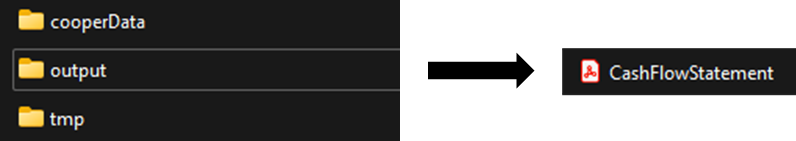

# User Guide

## Introducing cOOPer

Welcome to cOOPer's User Guide!

cOOPer is a **desktop application** developed to simplify administrative processes of **tech startups**
such as **communication** and **finance management**.

If you are running a tech startup, cOOPer can help you with **accounting** and **communicative** tasks like:
- **Generating** your company's **balance sheet**
- **Forecasting** your company's **cash flow**
- **Managing** and **generating** your company's **invoices**
- **Scheduling meetings** with your employees
- Having **discussions** with your employees

cOOPer  is optimized for use via a [**Command Line Interface (CLI)**](https://simple.wikipedia.org/wiki/Command-line_interface), so if you are someone who types fast,
cOOPer can help you manage your startup efficiently.

## What's in This User Guide

- [How this User Guide Works](#how-this-user-guide-works)
- [Quick Start](#quick-start)
- [Setup](#setup)
  - [Roles](#roles) 
  - [Signing in](#user-registration)
- [Log in](#login)
- [Features for all users](#features-for-all-users)
  - [Adding a forum post: `post add`](#adding-a-forum-post-post-add)
  - [Viewing a post / posts in the forum: `post list`](#viewing-a-post--posts-in-the-forum-post-list)
  - [Commenting on a forum post: `post comment`](#commenting-on-a-forum-post-post-comment)
  - [Deleting a forum post: `post delete`](#deleting-a-forum-post-post-delete)
  - [Declaring available timings for meetings: `available`](#declaring-available-timing-for-meetings-available)
  - [Viewing users available at different timings: `availability`](#viewing-users-available-at-different-timings-availabillity)
  - [Viewing scheduled meetings: `meetings`](#viewing-scheduled-meetings-meetings)
  - [Logging out: `logout`](#logging-out-logout)
- [Admin Features](#admin-features)
  - [Creating the balance sheet: `bs`](#creating-the-balance-sheet-bs)
  - [Creating the cash flow statement: `cf`](#creating-the-cash-flow-statement-cf)
  - [Adding entries to the financial statement: `add`](#adding-entries-to-the-financial-statement-add)
  - [Projecting cash flow: `proj`](#projecting-cash-flow-proj)
  - [Viewing the financial statement: `list`](#viewing-the-financial-statement-list)
  - [Generating a PDF from the financial statement: `generate`](#generating-a-pdf-from-the-financial-statement--generate)
  - [Scheduling meetings with different users: `schedule`](#scheduling-meetings-with-different-users-schedule)
- [Employee Features](#employee-features)
- [Exiting the program](#exiting-the-program-exit)
- [FAQ](#faq)
- [Command Summary](#command-summary)
  - [Admin commands](#admin-commands)
  - [Employee commands](#employee-commands)
  
## How this User Guide Works

Throughout this user guide, you will see text formatted differently from normal text, as well as symbols appearing before another line of text is displayed. 
The table below explains the formatting and symbols in this user guide.

**Formatting/Symbol** | **Meaning**              |
------------|------------------------------------|
*italics* |Text in italics represent special terminology specific to using cOOPer.
**bold**|Text in bold emphasizes the text's importance and indicates that you should pay more attention to the text.
`command` |Text highlighted in grey represent a command that can be entered in the Command Prompt/Terminal. 
`[argument]`|Text highlighted in grey wrapped in square brackets represent a command argument that needs to be present when a command is entered. You are free to decide the argument entered. 
`>>`|This symbol appears in the examples given for cOOPer's features. It represents cOOPer's [command prompt](https://en.wikipedia.org/wiki/Command-line_interface#Command_prompt) and it should not be included when you enter subsequent commands.
 ℹ️ |The info symbol indicates useful information about cOOPer's features.
💡     |The light bulb symbol indicates a useful tip which eases your usage of cOOPer. 
⚠️  |The hazard symbol indicates an important message you should take note of in order to avoid negative consequences.

## Quick Start

1. Ensure that you have Java 11 or above installed on your desktop.
2. Download the latest version of cOOPer [here](https://github.com/AY2122S1-CS2113T-W13-4/tp/releases).
3. Copy the JAR (.jar) file to an empty folder of your choice. This folder will be used as the *home folder* for your cOOPer application.
4. If you are using Windows, [launch the Command Prompt](https://www.lifewire.com/open-command-prompt-in-a-folder-5185505)
   in the home folder. If you are using Mac or Linux, [open a Terminal window](https://www.groovypost.com/howto/open-command-window-terminal-window-specific-folder-windows-mac-linux/#:~:text=To%20open%20a%20Terminal%20window%20from%20within%20a%20folder%20in,window%20to%20the%20selected%20folder.) 
   in the home folder.
5. Run cOOPer by entering `java -jar cOOPer.jar`.
6. A greeting from cOOPer should appear as such:

```
            /$$$$$$   /$$$$$$  /$$$$$$$
           /$$__  $$ /$$__  $$| $$__  $$
  /$$$$$$$| $$  \ $$| $$  \ $$| $$  \ $$ /$$$$$$   /$$$$$$
 /$$_____/| $$  | $$| $$  | $$| $$$$$$$//$$__  $$ /$$__  $$
| $$      | $$  | $$| $$  | $$| $$____/| $$$$$$$$| $$  \__/
| $$      | $$  | $$| $$  | $$| $$     | $$_____/| $$
|  $$$$$$$|  $$$$$$/|  $$$$$$/| $$     |  $$$$$$$| $$
 \_______/ \______/  \______/ |__/      \_______/|__/
=========================================================================
Hello I'm cOOPer! Nice to meet you!
=========================================================================
Login or register to gain access to my features!
To login, enter "login [yourUsername] pw [password] as [yourRole]"
To register, enter "register [yourUsername] pw [password] as [yourRole]"
=========================================================================
>> 
```

7. Refer to the [Setup](#setup) section for information on how to set up the app upon first-time use.

## Setup

### Roles
- There are two main roles you can hold as a user of cOOPer, namely the _**admin**_ role or the _**employee**_ role.

- You are eligible to hold the admin role if you hold a high position in the startup. e.g. Chief Executive Officer (CEO),
Chief Financial Officer (CFO), Human Resources Manager (HR), accountant etc.

- On the other hand, you hold the employee role if you are a basic employee at the startup.

- cOOPer offers tailor-made functions and features specific to your role to ensure the correct level of
administrative access within the company throughout cOOPer's usage.

### User Registration
- Upon first-time use of cOOPer, an individual holding the admin role in the startup is in charge of 
ensuring all members of the startup are registered with the correct role. (Each user is free to decide their own password)

- Once a member has been registered, they will be able to log in to cOOPer to access its features.

- How to register a user:
  1. When you see the greeting message as shown in the [Quick Start](#quick-start) section, enter `register [username] pw [password]
  as [role]`. 
  2. Upon successful registration, you should see a message informing you of your successful registration.
  3. You can now log in to access cOOPer's features specific to your role. Refer to the [Login](#login) section to
  find out more about logging in.

> ℹ️  `[username]` refers to the user's name, `[password]` refers to the user's password, while `[role]` refers to the user's role as determined [here](#roles).

- Example input:

```
>> register Sebastian pw 123 as admin
```

- Expected output:

```
=========================================================================
Sebastian is now successfully registered as an admin!
=========================================================================
```

> ℹ️ A similar output should be observed when an employee is registered, with the output now showing 'employee' instead of 'admin'.

### How cOOPer is to be Used
- The **correct** way (as of v2.0) of using cOOPer is to run cOOPer on a **single** desktop with only **a single user** interacting with cOOPer at a time.
> ⚠️ cOOPer's features related to scheduling meetings and posting to the forum **will not work** if **multiple users** are interacting with cOOPer on **multiple desktops** at the same time.

## Login
- Once you are successfully [registered](#user-registration), you can now log in to access cOOPer's features.
- How to log in:
  1. When you see the greeting message as shown in the [Quick Start](#quick-start) section, 
  enter `login [username] pw [password] as [role]`.
  2. You now have access to cOOPer's features specific to your role.

> ℹ️ `[username]`, `[password]` and `[role]` refer to the user's name and role as registered in cOOPer's system.
> 
> ⚠️ The username you are logging in with is **case-sensitive**. *e.g.* logging in with the username `sebastian`
> is not the same as logging in with `Sebastian`.

- Example input:

```
>> login Sebastian pw 123 as admin
```

- Expected output:

```
=========================================================================
You are now logged in successfully as Sebastian!
=========================================================================
```

> ℹ️ A similar output should be observed when an employee is registered, with the output now showing 'employee' instead of 'admin'.
> 
> 💡    Remember to record down your username and password somewhere (e.g. Sticky Notes, a password manager).

## Features for all users

### Adding a forum post: `post add`

### Viewing a post / posts in the forum: `post list`

### Commenting on a forum post: `post comment`

### Deleting a forum post: `post delete`

### Declaring available timing for meetings: `available`
- For easier scheduling of meetings, cOOPer has a function to gather availabilities of everybody to find a common time for a meeting.
- How to input your availability:
  1. After [logging in](#login) to the system, enter `available [time]`.
  2. You will now have your name stored under the specified time in the system.

> #### 📝Note:
> - `[time]` has a format of **HH:mm**, in *24-hour clock*. Any other format will **not** be accepted and your availability will not be stored.
> - Duplicate `[username]` in one timeslot will **not** be accepted.

- Example input:

```
>> available 14:00
```

- Expected output:

```
=========================================================================
Success!
Sebastian's availability has been added to 14:00
=========================================================================
```

### Viewing users available at different timings: `availabillity`

### Viewing scheduled meetings: `meetings`
- To view the table of availabilities after inputting [availabilities](#viewing-users-available-at-different-timings-availabillity), cOOPer generates a table to help you visualise the availabilities.
- How to view available timings:
  1. After [logging in](#login) to the system, enter `meetings`.
  2. You will now obtain a table with the availabilities entered.

- Example input:

```
>> meetings
```

- Expected output:

```
=========================================================================
These are the availabilities:
┌────────────────────────────────────────────────────────────────────┐
│ 10:00 │ Eugene
│ 14:00 │ Sebastian
└────────────────────────────────────────────────────────────────────┘
=========================================================================
```

### Logging out: `logout`

## Admin Features 

### Creating the balance sheet: `bs`

### Creating the cash flow statement: `cf`

### Adding entries to the financial statement: `add`
- Adds your company's expenses to a balance sheet.
- How to add an expense:
  1. After [logging in](#login) to the system, enter `add [amount]`.
  2. The expense will be added to the balance sheet.

> #### 📝Note:
> - By default, cOOPer treats `[amount]` as an inflow. To specify an outflow, a pair of parentheses should
> be added around `[amount]`. *e.g.* `add 5000` specifies an inflow of $5000 while `add (5000)` specifies an outflow of $5000.
> - `[amount]` should be a **positive integer** representing the amount of inflow/outflow added to the balance sheet.

- Example input for inflow:

```
>> add 5000
```

- Expected output:

```
```

- Example input for outflow:

```
>> add (5000)
```

- Expected output:

```
```

### Projecting cash flow: `proj`

### Viewing the financial statement: `list`
- Example input:

```
>> list
```

- Expected output:

```
```


### Generating a PDF from the financial statement : `generate`
- Creates a Portable Document Format (PDF) file from the *latest version* of the financial statement specified (Balance Sheet or Cash Flow Statement).
- How to generate the PDF file:
  1. Enter `generate [financialStatement]` where `[financialStatement]` is one of `bs` or `cf`.
  2. If **successful**, the PDF file is created in a folder 'output' in the home folder with the name 'FinancialStatementSpecified.pdf'.
  
- Example input for successful generation of the Balance Sheet PDF:

```
>> generate cf
```

- Expected output:

```
=========================================================================
The pdf file has been successfully generated!
=========================================================================
```

- The diagram below shows where you can find the generated PDF file.

 

> 💡   Always [add](#adding-entries-to-the-financial-statement-add) entries to your financial statement first before it is generated as a PDF.
> 
> ⚠️The PDF file will not be created if the specified financial statement is empty.

> ⚠️ **Important:** 
>- The creation of the PDF file requires an **active internet connection**. 
>- In the event that there is no internet connection, a backup '.txt' file will be 
>created in the same 'output' folder in which the PDF was supposed to be created.
>- The contents of the backup '.txt' file created can be used to recreate the PDF file with the use of an online LaTeX Editor. 
>
> 💡 **Always** ensure that you have an active internet connection before running `generate`. 


### Scheduling meetings with different users: `schedule`


## Employee Features
- As of v2.0, cOOPer does not have features exclusive to employees yet 😥, there will be more to come in future versions!

## Exiting the program: `exit`
Exits the program.
- Example input:

```
>> exit
```

- Expected output:

```
=========================================================================
Bye, see you next time! :D
=========================================================================
```


## FAQ
This section contains some frequently asked questions you may have when using cOOPer.

**Q**: How do I transfer cOOPer's data from the current desktop to another desktop?<br>
**A**: Follow the steps below:<br>
1. [Download](https://github.com/AY2122S1-CS2113T-W13-4/tp/releases) cOOPer in the other computer. 
2. In the current desktop, you should see a folder named `cooperData` in cOOPer's home folder. Refer to [Quick Start](#quick-start) if you do not 
know what the *home folder* is.
3. Copy `cooperData` over to cOOPer's home folder in the other desktop. 
4. Running cOOPer on the other desktop should load your saved data.

**Q**: Another person using cOOPer on their desktop stated their availability / posted to the forum. However, I am unable to see their availability / post when I run cOOPer on my desktop. Why does this occur?<br>
**A**: Refer to the [How cOOPer is to be Used](#how-cooper-is-to-be-used) section.

## Command Summary

### Admin Commands

**Command** | **Format**                          | **Example**
------------|-------------------------------------|------------
register    |`register [username] pw [password] as [role]` |`register Sebastian pw 123 as admin`
login       |`login [username] pw [password] as [role]` |`login Sebastian pw 123 as admin`
post add    |`post add [postContent]`             |`post add Who's up for dinner? :D`
post list   |`post list all` or `post list [postId]`|`post list all` or `post list 1`
post comment|`post comment [commentContent] on [postId]`|`post comment I'm up! on 1`
post delete |`post delete [postId]`               |`post delete 1`
bs          |`bs`                                 |`bs`
cf          |`cf`                                 |`cf`
add         |`add [amount]`                       |`add 5000` or `add (5000)`
proj        |`proj [years]`                       |`proj 5`
list        |`list`                               |`list`
generate    |`generate [financialStatement]`      |`generate bs`
available   |`available [username] at [time]`     |`available 14:00`
availability|`availability`                       |`availability`
schedule    |`schedule [meetingName] with [username1], [username2] /at [time]`|`schedule Progress Meeting with Sebastian, Eugene /at 14:00`
meetings    |`meetings`                           |`meetings`
logout      |`logout`                             |`logout`
exit        |`exit`                               |`exit`

### Employee Commands

**Command** | **Format**                          | **Example**
------------|-------------------------------------|------------
register    |`register [username] pw [password] as [role]` |`register Sebastian pw 123 as admin`
login       |`login [username] pw [password] as [role]` |`login Sebastian pw 123 as admin`
post add    |`post add [postContent]`             |`post add Who's up for dinner? :D`
post list   |`post list all` or `post list [postId]`|`post list all` or `post list 1`
post comment|`post comment [commentContent] on [postId]`|`post comment I'm up! on 1`
post delete |`post delete [postId]`               |`post delete 1`
available   |`available [username] at [time]`     |`available 14:00`
availability|`availability`                       |`availability`
meetings    |`meetings`                           |`meetings`
logout      |`logout`                             |`logout`
exit        |`exit`                               |`exit`